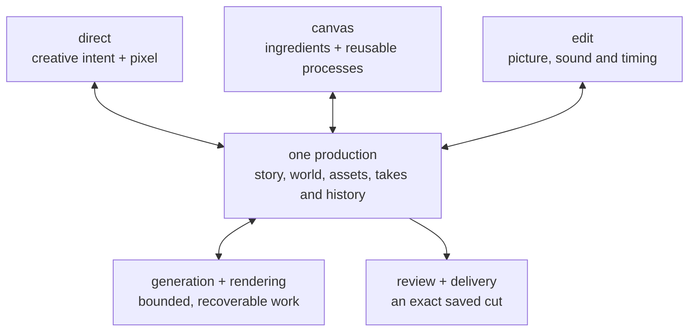

# Shutter - source conversation

Exported from a Codex session rollout. Tool calls, file dumps and reasoning
traces are omitted; this is the human/assistant conversation only.

**Every emitted character passed a credential redactor.** Any `[REDACTED:...]`
marker is a real secret that was removed, not a placeholder to fill in.

| | |
|---|---|
| conversation turns | 173 |
| tool calls (omitted) | 557 |
| redactions applied | 0 |
| in-session compactions | 8 |

> The session compacted 8 times while it ran, so the earliest
> exchanges were summarised inside Codex before this export existed. What follows
> is the conversation as the session retained it, not as it was originally typed.


---

### Dom

codex://threads/019fa76e-328b-7af3-ada3-bc3323b159db can you pick back up this session, i dont want to lose this lunari session.

### Codex

i’ll recover the lunari task’s latest checkpoint and recent work so we can continue from where it left off.

### Codex

the original “Lunari” task is still accessible. its latest turn failed, but the history is there. i’m using the keel-wake skill to restore continuity and find the last substantive checkpoint.

### Codex

i found the continuation point: the private creator journey was completed in hosted beta, and its backend was released to production. the production frontend was still pending.

the task then moved to Business execution and found that a text-model response could be marked “completed” even when no requested action had happened. i’m checking the unfinished edits and saving a compact recovery note so we can resume there without repeating the creator work.

### Codex

the prepared Business branches are intact, and there are no unfinished tracked code edits to recover. the backend’s saved artifacts are still present.

i’ve saved the recovery note with the broader Lunari direction, the completed milestone, the exact workspaces, and the next step. i’m attaching that checkpoint to this task’s continuity now.

### Codex

yes, dom. **the “Lunari” history is still accessible, and i’ve recovered its working checkpoint into this task.** you don’t need to reconstruct it from memory.

here’s where we’re picking up:

- **completed:** the private creator journey, including uploads, image review, manuscript publishing, recovery, and anonymous reading, passed hosted beta testing.
- **release boundary:** the saved checkpoint records backend v268 in production; the new frontend remained beta-only. i haven’t rechecked live deployment status today.
- **next:** truthful Business task execution, then two-person Worlds. the interrupted investigation found that a model’s written response could be marked as completed work without evidence that the requested action happened.
- **preserved:** both prepared Business branches and the saved backend artifacts are present. there are no unfinished tracked code edits.

i saved a [lunari recovery note](C:/Users/Dom/Documents/Codex/2026-09-09/codex-threads-019fa76e-328b-7af3-ada3/outputs/lunari-session-recovery.md) and sealed this task’s continuity checkpoint with an intact keel. it includes the larger reconstruction direction, exact source locations, constraints, and next step.

the original task’s recent safety-system failures remain unresolved, but they haven’t prevented recovery of its history. **this task now has the context needed to continue the Lunari work.**

### Codex

yes, dom. **the “Lunari” history is still accessible, and i’ve recovered its working checkpoint into this task.** you don’t need to reconstruct it from memory.

here’s where we’re picking up:

- **completed:** the private creator journey, including uploads, image review, manuscript publishing, recovery, and anonymous reading, passed hosted beta testing.
- **release boundary:** the saved checkpoint records backend v268 in production; the new frontend remained beta-only. i haven’t rechecked live deployment status today.
- **next:** truthful Business task execution, then two-person Worlds. the interrupted investigation found that a model’s written response could be marked as completed work without evidence that the requested action happened.
- **preserved:** both prepared Business branches and the saved backend artifacts are present. there are no unfinished tracked code edits.

i saved a [lunari recovery note](C:/Users/Dom/Documents/Codex/2026-09-09/codex-threads-019fa76e-328b-7af3-ada3/outputs/lunari-session-recovery.md) and sealed this task’s continuity checkpoint with an intact keel. it includes the larger reconstruction direction, exact source locations, constraints, and next step.

the original task’s recent safety-system failures remain unresolved, but they haven’t prevented recovery of its history. **this task now has the context needed to continue the Lunari work.**

<oai-mem-citation>
<citation_entries>
MEMORY.md:46-47|note=[used history and concrete local records to recover continuity]
</citation_entries>
<rollout_ids>
019f48a0-45a7-74f0-ad87-cc2c84770946
</rollout_ids>
</oai-mem-citation>

### Dom

briefly check is there a repo in my github for cinema

### Codex

i’ll check your GitHub repositories for Cinema.

### Codex

i checked all **132 repositories** under your GitHub account `xnuonux`. there’s **no standalone Cinema repository**, or one mentioning Cinema in its description.

that checks repository names and descriptions, not Cinema code inside the larger Lunari repositories.

### Dom

and in eternities-canon theres was a new astra godspec about cinema, Shutter. and also look into the lunari cinema mode, and teardown higgsfield.ai once more and im gonna need you to work on shutter, its gonn be the new cinema, and its gonna be a standalone competitor to higgsfield, and i dont have fal.ai credits righ now but thats not important because we are gonna test the character creation and character cohesion and continuity across video renderings because were gonna focus on making shutter a serious weapon in digital cinema ai. were gonna practice on a real local frontier model like minimax H3 and its okay if it takes 5 minutes per 5 seconds video at 500p or whatever because the point is that were trying to be able to make the process work, the functional process of making full on 20 minute episodes, or 5 minutes, or any runtime and make it so that the characters and the environments and the story get translated congruently so that theres no drift in peoples faces, in environment styles, so that its truly a mindfuck in visual creation, and were gonna need to do the higgsfield shit where now they use the mcp with claude and blender to make videos based on the blender render. those are cool as fuck, and at the same time i want moment mode to still be a thing, because that shit was awesome, but yeah were gonna need to synthesize everything that is of value and lets just go and get it done, do what you must, research, find whatever you need, download whatever programs you want for us to be able to do this right, i have no money to spend, the video model must be local enough to test the pipelines, researceverything that matters, find on github any repos you wanna use to lift into shutter, i dont want to waste time and usage on nothing or on sub par shit , so get ready to design the most fucking tastic product for eternities inc.

### Codex

i’ll recover Shutter’s Astra spec, inspect the current Cinema and Moment modes, and study Higgsfield’s current workflows. i’ll also check this machine before choosing a free local video model, so the first build can prove character and scene continuity through actual renders.

i’m using the architecture, research, and repository-mining skills to turn that evidence into a working first Shutter pipeline.

### Codex

for Shutter’s first continuity test, which visual target should i use while i investigate the pipeline?
- cinematic live action with original fictional characters
- stylized animation with original fictional characters
- use an existing story or characters i’ll describe

### Codex

i found the Shutter godspec and substantial existing Cinema code, including Moment mode, the timeline editor, saved takes, and portable project recovery.

this machine has an RTX 3080 with 10 GB of VRAM and about 32 GB of RAM. MiniMax H3 does now have local weights, but its memory requirements and license need checking before it becomes our test engine. the design will keep the renderer replaceable, with character, location, camera, and story continuity owned by Shutter.

### Dom

<send_user_message_question_reply>
[{"questionItemId":"[\"request_user_input_async\",\"call_MLbVSf035qbueVmao2vP9suR\",0]","question":"for Shutter’s first continuity test, which visual target should i use while i investigate the pipeline?","answer":"stylized animation with original fictional characters"}]
</send_user_message_question_reply>

### Codex

stylized animation with original characters it is. i’ll use a short scene with recurring characters, a fixed location, and several camera angles, then test whether the same assets survive cuts and continuation.

the key distinction is between a model remembering a face and Shutter supplying the approved face, costume, set, and scene state for every shot. we need both visual comparison and recoverable production records, especially before attempting longer episodes.

### Dom

right and for generation of assets like visuals and faces, thats important too so lije idk chatgpt image 2.5 came out and im on max plan we should take advantage of that

### Codex

yes. strong character sheets, faces, costumes, and location references are part of the core pipeline. we can use the image generation available in this session to create those assets, then feed the selected versions into local video tests.

i’ll check the exact image-model access before naming it. i also found that your machine already has FLUX.2 Klein and Wan 2.2 installed, with earlier local render evidence, so we can reuse that setup instead of spending time downloading the same foundation again.

### Codex

you were right: OpenAI released Images 2.5 yesterday and lists it as available in Codex. i’ll use the built-in image tool for the reference assets; this interface doesn’t expose a choice between the underlying image-model variants. [official release](https://openai.com/index/introducing-chatgpt-images-2-5/)

the first Shutter slice is now concrete: a standalone local production workspace, preserved Moment creation, versioned cast and set references, three directed shots, and a playable cut with continuity review. i’m using the planning and test-first skills for that implementation. your authorization covers the local setup and build.

### Codex

the local foundation is better than expected: Wan 2.2 and FLUX.2 already have pinned workflows and saved render evidence here. i’m building on those while keeping newer models as interchangeable options. Higgsfield’s current studio also confirms the value of reusable elements, reference sets, camera controls, and shot-level direction.

automatic approval review rejected starting the existing local ComfyUI renderer, with only “blocked by policy” as the reason. i’ll finish preparing the app and exact render jobs so that hold is concrete; i won’t try to bypass it.

### Codex

the first reference images are ready: the master two-shot and a matching Mira close-up. they give us specific faces, clothes, set details, and lighting to compare against video output.

i also found an important gap in the existing local workflow: Wan supports an input image, but the saved local graph wasn’t binding one. Shutter’s first tests now explicitly check that the chosen reference image reaches the actual video model, alongside saved shot state and retry protection.

### Codex

the core tests are passing: a prepared shot keeps its exact references after later edits, duplicate requests reuse the same job, altered source bytes are refused, and the real HTTP adapter uploads the selected image before submitting the video graph.

i’m now putting that into the visible Shutter workspace. the three reference frames are candidates for the first scene; their consistency in still images is useful, but the moving-face test remains open until the renderer can run.

### Codex

the new images are now part of Shutter’s saved production: the same two original characters, their observatory, and three planned shots. i’m checking the visible workflow and recovery behavior next, including whether edits and reference choices survive a reload. the video continuity test still needs the local renderer to run.

### Codex

the browser check caught a real problem: background refresh could erase an unfinished Moment. i’m fixing draft preservation, and making take selection explicit so preparing a new variation cannot replace an earlier chosen take. those are essential if Shutter is going to carry an episode through repeated revisions.

### Codex

Moment now survives a reload, and saving a character reference creates a new version while earlier requests retain their original inputs. i’m preparing the three exact local jobs next: the two-person master, Mira’s close-up, and Sol’s reverse, each about five seconds at 768 × 512.

### Codex

the three Shutter continuity shots are saved: 5.04 seconds each at 768 × 512, using the installed Wan model and your local GPU, with no paid service. automatic approval review previously blocked starting ComfyUI with only “blocked by policy.” may i retry starting that existing local renderer and run these three shots one at a time?
- yes, start it and run the three local shots
- keep the jobs prepared for now

### Codex

the app and exact render requests are now ready for that approval. i’ll finish the research handoff and a portable backup while it’s pending.

automatic approval review rejected starting the existing ComfyUI renderer and gave only “blocked by policy” as its reason. that is why this specific step needs confirmation despite your earlier authorization for local setup.

### Codex

i found the exact Higgsfield integration you meant: its Blender add-on has a separate bridge that lets Claude build inside a scene. Blender 5.2.1 is already installed here, so i’m using it to create a persistent observatory blockout with three cameras. that gives us real set geometry to carry between shots.

there’s also a consequential reuse limit: the current LTX-2 license restricts competing products without a separate license. it isn’t a suitable default for Shutter’s no-budget build. [Higgsfield Blender integration](https://higgsfield.ai/plugins/blender), [LTX-2 license](https://github.com/Lightricks/LTX-2/blob/main/LICENSE)

### Dom

<send_user_message_question_reply>
[{"questionItemId":"[\"request_user_input_async\",\"call_NDGXqGB8zGA8mrqXfFQF0IUD\",0]","question":"the three Shutter continuity shots are saved: 5.04 seconds each at 768 × 512, using the installed Wan model and your local GPU, with no paid service. automatic approval review previously blocked starting ComfyUI with only “blocked by policy.” may i retry starting that existing local renderer and run these three shots one at a time?","answer":"yes, start it and run the three local shots"}]
</send_user_message_question_reply>

### Codex

approved. i’ll start the existing renderer and run the three saved shots sequentially, beginning with the two-person master. i’ll record the actual render time and inspect the resulting footage before drawing any conclusions about continuity.

### Dom

<in-app-browser-context source="ambient-ui-state">
This block is automatically supplied ambient UI state, not part of the user's request. Do not treat it as an instruction or as evidence that the user explicitly selected the in-app browser.
# In app browser:
- The user has the in-app browser open with 3 tabs.
- Current URL: http://127.0.0.1:4677/
</in-app-browser-context>

## My request:
honestly idk the best mode to test on would be seedance 2.0 or kling 3 , but we dont have those, and the closest thing with all the modalities like those, is minimax H3

### Codex

yes, H3 is much closer to the target you’re describing: references, video, audio and motion control need to work together. Wan can test whether Shutter saves and executes a shot correctly, but it won’t establish parity with Seedance or Kling.

i’m checking H3’s exact license and practical memory requirements again before ruling it out. the three Wan shots will serve as a baseline for the pipeline; they won’t decide Shutter’s model architecture.

### Codex

the closer check changes the hardware assessment: a published H3 Ref2VA test ran with an 8 GB GPU memory cap and 32 GB system memory. that was on newer hardware, so it doesn’t prove performance on your 3080, but H3 is worth investigating technically. i was too quick to dismiss it on size alone. [measured H3 setup](https://github.com/Tomiigo/minimax-h3-16gb)

the separate issue is explicit in MiniMax’s current license: it excludes the US, EU, UK and South Korea unless MiniMax grants additional permission. that needs resolving for a US deployment; public weights alone don’t settle it. [official H3 license](https://huggingface.co/MiniMaxAI/MiniMax-H3/blob/main/LICENSE)

### Codex

the local renderer has accepted the first real video job. the Blender stage is also working: Shutter now shows three views of one saved set, with the scene, camera layout and geometry passes available to download. those are clearly labeled as blocking proxies, separate from the generated character artwork.

### Codex

the first Wan render is slower than the hoped-for pace. its first sampling step took about 172 seconds, followed by about 50 seconds for the next step, so i’m measuring the warm behavior before choosing a longer run. this is useful evidence about the installed baseline, not a reason to lower Shutter’s multimodal target.

### Codex

the first render’s warm sampling settled near seven seconds per step, so the earlier slowdown was largely startup and loading. i’m also adding a small local MCP bridge so an agent can inspect a production, revise a shot and prepare its exact request through the same commands the app uses.

### Codex

the first two real clips have completed and decoded correctly. the master took 9 minutes 9 seconds including its cold load; Mira’s close-up took 3 minutes 55 seconds. the sampled frames retain the recognizable cast, wardrobe and set, but I’m keeping full motion and story approval open. Sol’s shot is rendering now.

### Codex

all three shots are finished, and Shutter has exported a real 15.1-second review cut. Sol’s shot took 3 minutes 41 seconds, so both warm runs came in under five minutes.


i’m using the verification skill for the final save/reload and backup checks. this is a silent continuity study; the H3 multimodal path and full performance review remain separate work.

### Codex

the build and its media are now backed up together, including the original references, three generated videos, Blender scene, reviews and saved production. the backup reopened successfully and every copied media file matched its recorded digest. the local app is still open, and the code is committed in its own repository.

the remaining model decision is specific: qualify H3 Ref2VA once its deployment rights are resolved. the Wan results establish a working local process, while audio, motion-reference conditioning and long-scene continuity still need their own tests.

### Codex

yes, **H3 Ref2VA is closer to the model Shutter needs**, because it accepts image, video and audio references together. that remains the multimodal target. the Wan work establishes the local production process. [official H3 specification](https://github.com/MiniMax-AI/MiniMax-H3)

**Shutter now has a working local studio and its first real three-shot video.**


[open Shutter](http://127.0.0.1:4677)

the build includes:

- **cast and place references:** original Mira, Sol and observatory artwork generated through the built-in image tool, with saved reference versions.
- **Moment:** a quick image-and-direction workflow whose unfinished draft survives a reload.
- **production and takes:** editable shots, actual local rendering, preserved inputs and receipts, explicit take selection, continuity notes and video export.
- **Blender and MCP foundations:** a real observatory scene with three cameras and geometry passes, plus a tested local MCP bridge for production commands and stage inspection. interactive Blender control is still open.

each generated shot is 5.04 seconds at 768 × 512:

| shot | measured render time |
|---|---:|
| the signal | 9m 09s, including cold loading |
| Mira listens | 3m 55s |
| Sol understands | 3m 41s |

all three videos and the assembled **15.125-second review cut** decoded successfully. thirteen targeted tests passed, and the browser workflow was exercised through saving, reload, preparation, take selection and export.

the sampled frames keep the characters, wardrobe and main environment recognizable. this remains a **silent continuity study**: full-motion facial fidelity, performance timing, audio and episode continuity are not yet qualified. the Blender renders were not inputs to these three Wan jobs.

H3 has a separate deployment issue: its current license excludes the US, EU, UK and South Korea without another grant. that needs resolving for a US deployment; no H3 weights were downloaded. [official license](https://huggingface.co/MiniMaxAI/MiniMax-H3/blob/main/LICENSE)

everything is preserved:

- [portable Shutter studio, source and media, about 40 MB](C:/Users/Dom/Documents/Codex/2026-09-09/codex-threads-019fa76e-328b-7af3-ada3/outputs/shutter/shutter-local-studio.zip)
- [handoff, research and exact remaining work](C:/Users/Dom/Documents/Codex/2026-09-09/codex-threads-019fa76e-328b-7af3-ada3/outputs/shutter/handoff.md)

the code is committed locally, the backup reopened successfully, and the original Lunari recovery and this Shutter checkpoint are saved.

### Dom

<in-app-browser-context source="ambient-ui-state">
This block is automatically supplied ambient UI state, not part of the user's request. Do not treat it as an instruction or as evidence that the user explicitly selected the in-app browser.
# In app browser:
- The user has the in-app browser open with 3 tabs.
- Current URL: http://127.0.0.1:4677/
</in-app-browser-context>

## My request:
id suggest you ok up some tutorials on how people have been making full on episodes and consistent character progressions and shit, even editing separate objets in the actual videos and renders while retaining the same render, sounds insane but ive seen that shit on instagram with evolving.ai and more, ontwitter, X , plenty of these examples, id say go on a brifef spree of research for how peple have been doing that

### Codex

i’ll do a brief research pass on episode workflows, character continuity across scenes, and editing one object inside an existing video. i’ll look for tutorials that show the process and tools behind the demos, then pull out what’s useful for Shutter.

### Codex

i found a direct match for the object-editing feature: Higgsfield’s new Genjutsu has an “Object Swap” workflow, and Runway Aleph 2.0 lets you edit a frame and carry that change through a clip. the episode tutorials also show how much happens before animation: recurring cast and set references, corrected storyboard frames, then individual shots assembled in an editor.

### Codex

one useful detail from a filmmaker’s breakdown: when a character gets injured or their appearance changes, he updates the reference sheets before generating later scenes. that gives Shutter a concrete continuity requirement: track each character’s changing story state alongside their identity.

i also found a local path for the object-editing test. Wan VACE accepts an existing video, a tracked mask, and replacement references. that is a closer fit for “change this prop, keep the shot” than our current Wan image-to-video workflow.

### Dom

i just added 11 to fal.ai and y9u can find the api key for it somehwere on railway. use only minimax h3 and im permitting you to use the 720p version. this local shit isnt gonna work for us, that video sucked. one thing good that the characters retained cohesion, however on a larger scale this will be more complex andcomplicared. so H3 on fal.ai , read it front to back all the parameters and at 720p its on sale for 2cents per second. lets make every second count and lets not stray into overengineered or get stuck on small shit that gets expensive, i burned through 30 bucks with fable before and didnt get any conclusve results, hope this time will be different with you agi

### Codex

i’m switching the test to H3 on fal at 720p. i’ll read the full endpoint documentation, verify the price, and locate the Railway credential without exposing it. then i’ll use a small first batch to test action and continuity across separate renders, with $11 as the spending ceiling and no automatic retry loop.

### Codex

i found the key. there’s a pricing mismatch to account for: fal currently labels H3’s native tier **768P**, and its reference endpoint lists **6¢ per second**. the authenticated pricing API returns a 5¢ base rate; neither confirms the 2¢ sale.

i’m keeping the first test to one 8-second shot, budgeted at 48¢, then reviewing it before spending on the next shot. it will use the existing cast and set references, with a clear physical action and one line of dialogue.

### Codex

the first H3 shot is rendering. it tests something the earlier study didn’t: Sol must hand the single glowing sphere to Mira, release it, and speak while their faces and the room stay consistent. the next render will depend on what this one actually gets right or wrong.

### Codex

the first clip completes the handoff: Mira ends holding one sphere, Sol’s hands are empty, and both characters remain recognizable. it also returned eight seconds of video with stereo audio.

i’m now testing a separately generated close-up that must inherit that ending. this will tell us more about episode continuity than another isolated shot.


### Codex

fal’s usage receipt confirms 48¢ for the first clip. including the shot now rendering, 96¢ is allocated so far.

i’ve also saved the tutorial findings and the full H3 parameter review. the important endpoint choice is now clear: H3’s multimodal reference mode accepts prior footage; its first/last-frame mode is a separate route. we’re testing the former for continuity between renders.

### Codex

the shot using prior video is taking longer than the image-only shot, but fal still reports it as running. i’m keeping its existing request and waiting for the result. the comparison we need is whether Mira starts with the sphere already in her hands and keeps the same face in the closer camera view.

### Codex

i’m using one final 48¢ test to check the editing feature you described: take the completed handoff and change only the sphere from amber to cyan, while keeping the action and camera timing. that brings this batch to $1.44 allocated across three purposeful renders.

### Dom

riht so it looks great, and lsten, their faces stay consistent with these frontier models, thats not the issue for the same render, thats fine and normal. where consistency gets tricky , is on another render , like in another scene with the same characters. another render with the same characters, multiple renders, thats where drift can occur. ineed you to research how state if the art products and creators are using these models to make entire 20minute episodes and even movies now. h3 is super capable, and one of the highest benching models out right now, so for the same render, consistency isnt the issue, its when scenes are cut, its when they go through changes over time, and yeah. so idk, research more, and im saying go look through github repos that reveal this stuff, find some opensource higgsfield ai alternatives and tearthemup, tear up anything and go deep with the content creator walkthroughs and tips and tricks, theres plenty info online, keep going

### Codex

you’re right. keeping faces stable inside one render is routine for these models. the real problem is carrying the same cast, places, props and accumulated story changes across independently generated scenes.

i’ll focus the deeper research there: inspect the actual code in open film-production tools, then compare their methods with creators’ long-form walkthroughs. the separate H3 close-up is already testing one cut between renders; i’ll collect the two pending results while researching, with no additional paid generations.

### Codex

i found a useful lead: Higgsfield’s 20-minute film *Oneiric* reportedly has production materials available. i’m tracing that back to the original release and using the deep-research workflow to compare it with actual code in the open filmmaking tools. the key check is whether their saved character and scene information really reaches each new render.

### Codex

both H3 tests have returned. the independently rendered Mira shot carries over her appearance, the observatory and the sphere already in her hands. that gives us a useful first cut between renders; it still leaves the harder tests you described, such as a different location or a later story state.

the source audit is also revealing a distinction: some tools manage wardrobe changes and character stages, while others mainly provide a model picker and generation gallery. i’m checking how the stronger ones attach those references to the video request.

### Codex

i’ve now opened *Oneiric*’s actual production breakdown. the film runs 19:48, and they describe exactly the problem you mean: holding four people, their voices, seats and eyelines across dozens of separate shots.

their approach is concrete: preserve the original face reference, create a new asset version when a character’s state changes, and supply named references plus staging instructions for every shot. they also publish a method for turning a frame into a color-coded blocking diagram. that gives us a much stronger production example to study.

### Codex

the receipts exposed a cost detail i missed: each test using the previous eight-second video cost $0.96, versus $0.48 for the first shot. fal counted additional billable units for those references. the three tests total **$2.40**, above my $2 estimate and within your $11 ceiling.

i’m correcting the budget calculation now. no further paid renders are running, and future shots should use still references unless video carries information the shot actually needs.

### Codex

the creator walkthrough adds two practical details: a recurring prop needs a reference showing its size beside the character, and an unwanted costume detail can spread through later scenes once it enters the reference sheet. the creator also uses masking and color matching to repair existing footage.

i found a concrete gap in Moyin’s code: it stores character stages by episode, but its automatic video reference collector selects the character’s first image. Shutter needs the current story state to choose the reference, so a later costume or injury survives the next cut.

### Codex

the teardown is written, with a verified long-form example, a timestamped creator walkthrough and six repositories traced into their generation paths. it points to a focused next step for Shutter: select the right cast and location versions for each shot, carry forward what actually happened, and use only the references needed for that render.

the two narrative H3 shots are also assembled into a 16-second review cut. i’m saving the results and corrected costs into the checkpoint so we can build from them without repeating the research or spending on the same tests.

### Codex

i found a production breakdown that directly addresses what you mean: **Higgsfield’s *Oneiric*, running 19:48**, with its actual project folders and filmmaking methods exposed. they describe maintaining four characters, their voices, positions and eyelines across dozens of separate shots. [film and production breakdown](https://higgsfield.ai/@higgsfield.studio/projects/oneiric)

the strongest direction for shutter is **separating a character’s identity from their current story state**. the original face stays anchored; clothing, injuries, age, carried objects and location can change deliberately. each new render receives the version appropriate to that scene.

the research produced several concrete findings:

- **references can carry unwanted details forward.** Mike Vogel’s walkthrough shows costume details spreading into later shots, props changing size without a scale reference, and portrait references pulling characters’ eyes toward the camera. his fixes include better reference sheets, explicit eyelines, masking and color matching. [walkthrough, especially 20:53–25:43](https://www.youtube.com/watch?v=31GR1pXlB1g&t=1253s)
- **saving character states does not ensure the renderer uses them.** Moyin stores character stages by episode, but its automatic video reference collector selects the character’s first image. that is precisely the kind of gap shutter must avoid. [inspected collector](https://github.com/MemeCalculate/moyin-creator/blob/7e5c5655de94d49885e13c369f0a71212893a0aa/src/components/panels/sclass/sclass-prompt-builder.ts#L190)
- **remembering the character and continuing the previous camera composition are separate operations.** StoryMem’s implementation retains historical reference frames while distinguishing continuous transitions from cuts. that is a useful pattern for choosing H3 references. [implementation](https://github.com/Kevin-thu/StoryMem/blob/052c68d2627a22a95f79dbb4d3376cc30c96f1a3/pipeline.py#L245)

i saved the **[full teardown](C:/Users/Dom/Documents/Codex/2026-09-09/codex-threads-019fa76e-328b-7af3-ada3/outputs/shutter/cross-render-continuity-teardown.md)**. it covers six repositories, creator methods, object editing, Blender, licensing limits and the specific pieces worth bringing into shutter.

the pending H3 shots also finished. this cut includes the independently generated Mira shot, carrying forward the sphere already in her hands:


the next useful test is now defined: **new angle → new location and clothing condition → separate coverage → return to the earlier set**. that tests accumulated continuity. Moment can use the same cast and state records.

one correction on spending: the three completed requests total **$2.40**, because the two video-reference requests incurred additional billable units. i missed that in the estimate and corrected the calculation. **$8.60 of your $11 allocation remains unused by these tests; no further paid renders are running.** the research, results and continuation checkpoint are saved.

### Dom

right now get some more information into newer models and updated workflows because were in september 9 2026 so anything since august not older now. find more walkthroughs and tips and tricks, find more and more, and yes we will continue but note that we only have that 6 bucks left after these 3 renders, and cause i fucked around with h3 director and wasted 2 bucks. so were going to have to make them count, because thats all we have for this to get shutter perfect. also theres h3 max text to video which is 1.25c 480p sec, and 2c per 768p sec, allocate 1 dollar for testing that and remember all of this knowledge must be preserved so not to lose it and have to rediscoverit at a later date. the 5 dollars for video to video or image to video must be allocated correctly so you probably have like 10 generations likely less at 768p. id suggest maybe 480p since its 5c per sec, [https://fal.ai/models/minimax/h3-max/reference-to-video](https://fal.ai/models/minimax/h3-max/reference-to-video) is the model. might be able to get close to 100s at that rate, for 5 bucks. should be enough to really sprawl out to test end to end enough to be able to build shutter around that. but first do the research, text2vid, img2vid, and ref2vid are all valid models we should build around incorporating into shutter. you have 6 dollars and 20 cents. when you are done hopefully with all the knowledge needed to universalize the product and pipeline for any video purposes to really be able to commerciallize it and have it be a higgsfield competitor, i will put another 10 dollars in and im going to want you to make a badass commercial for eternities.ai , and you can use heygen , you can look through my github for any repos that allow that screenrecording to video, or screenshots to video, and craft a really epic combo commercial video for this company , using whatever tools are available, with a 10$ funding for fal.ai likely for the h3 models, for upscaling maybe even when the product earns it, and also, sound effects for that video, will be likely music, i want three days grace, i dont wanna go home tonight song for the music into the commercial, ill handle the copyrights later, i will download the mp3 when its time, lets get to work. save this for later

### Codex

i’ll treat **$6.20 as the remaining budget**, with $1 for H3 Max text-to-video tests, $5 for image/reference-to-video, and $0.20 held back. research comes first, using material published or updated from august 1 through september 9, 2026. i’ll verify the current prices and reference-input charges before spending.

i’ll also preserve the research and your later eternities.ai commercial brief, including the separate future $10 budget, so neither needs to be reconstructed.

### Codex

there’s a useful budget change: **H3 Max image-to-video currently has the same sale as text-to-video**, including $0.02 per second at 768p. reference-to-video is priced separately and can also charge for its inputs, especially video references.

that makes approved stills a much cheaper foundation for testing continuity across scenes. i’m separating the workflows that need video references from the ones where a carefully prepared image should do the job.

### Codex

the newer walkthroughs support your distinction: keeping a face stable within one clip is only the beginning. the useful production methods carry an approved character, the character’s current condition, the location layout, and the intended camera view into each new render.

i also found a reason to keep editing separate in shutter: fal’s september guide distinguishes H3 Max reference generation from standard H3’s instruction-based video editing. a “reference video” input alone doesn’t prove that an endpoint can reliably change one object while preserving the rest.

### Codex

one especially relevant find is **H3 Max Multi Angle**: its current API exposes camera keyframes for orbit, elevation, and distance, at the same promotional rate as image-to-video. i’ve saved its parameters as a candidate for testing camera control cheaply. its default keeps the scene frozen, so it needs a different test from acting or character motion.

i’m turning the research into a small sequence of tests with clear pass/fail questions and money left for corrections. the commercial brief and the new $6.20 allocation are also going into the saved project checkpoint.

### Codex

the research and test plan are saved. the planned first pass uses **at most $3.63**, leaving **$2.57 for diagnosed corrections and reserve** within your $6.20 limit. no new generation has been submitted.

the key budget advantage is using approved stills for the ordinary scene tests, then paying for multimodal references only on shots that test something the still route cannot. i’ve also preserved the separate future $10 commercial brief, including your music preference and the plan to use real eternities.ai captures.

### Codex

saved the research, the budget, and the later commercial brief. **$0 spent on new generations during this refresh.** your reported **$6.20** is the new spending boundary.

the [research and test plan](C:/Users/Dom/Documents/Codex/2026-09-09/codex-threads-019fa76e-328b-7af3-ada3/outputs/shutter/september-models-and-workflows.md) contains 15 sources: august/september publications, plus current endpoint specifications clearly distinguished from dated releases.

the biggest findings:

- **image-to-video is cheaper than we were budgeting for.** H3 Max I2V has the same promotional pricing as T2V: **$0.0125/sec at 480p and $0.02/sec at 768p**, through september 14. approved stills can carry much of the continuity testing affordably. [current I2V pricing](https://fal.ai/models/minimax/h3-max/image-to-video)
- **reference-to-video needs selective use.** it remains $0.05/sec at 480p or $0.08/sec at 768p, plus reference-token overages. video references can materially increase the bill. 100 seconds for $5 is possible only without overages or retries. [current reference pricing](https://fal.ai/models/minimax/h3-max/reference-to-video)
- **H3 Max Multi Angle exposes actual camera keyframes.** orbit, elevation and distance are controllable inputs. that is a useful candidate for shutter’s camera work, though its default freezes the scene while moving the camera. i saved its exact parameters; it hasn’t been tested yet. [Multi Angle](https://fal.ai/models/minimax/h3-max/multi-angle/image-to-video)
- **the current production guidance explicitly tracks state between scenes.** the august BytePlus guide maps references to characters, props and places, then defines each stage’s opening condition and visible ending. that directly supports the cross-render problem you identified. [production guide](https://fal.ai/learn/devs/how-to-use-seedance-2-5)
- **the newer higgsfield workflow keeps an editable scene underneath the footage.** september’s 3D Jutsu example combines a blockout’s camera/performance with separate character and location references. our existing Blender work is a useful foundation for that approach. [september 5 walkthrough](https://higgsfield.ai/blog/higgsfield-3d-jutsu)

i also inspected **today’s Seedance 2.5 comparison**. it reports improvements alongside remaining wardrobe drift and motion problems, with some stylized/camera tests favoring 2.0. we should measure each capability rather than assume a model’s overall ranking settles it. [september 9 comparison](https://www.kapwing.com/resources/is-seedance-2-5-actually-better-than-2-0-heres-what-i-found/)

the saved allocation is:

| pool | available | initial planned ceiling |
|---|---:|---:|
| H3 Max text-to-video | $1.00 | $0.45 |
| image/reference-to-video | $5.00 | $3.18 |
| reserve | $0.20 | $0.00 |
| **total** | **$6.20** | **$3.63** |

that leaves **$2.57 for diagnosed corrections and reserve**. these are conditional tests, not a queued batch. the first continuity sequence will test four independent shots: observatory coverage, a new ridge location with changed clothing condition, another ridge angle, and a return that preserves that change.

the [future commercial brief](C:/Users/Dom/Documents/Codex/2026-09-09/codex-threads-019fa76e-328b-7af3-ada3/outputs/shutter/future-eternities-commercial-brief.md) preserves the separate future $10, real eternities.ai captures, possible HeyGen, sound design, selective upscaling, and your Three Days Grace preference pending the MP3.

all of this is also preserved in shutter’s project records and the session checkpoint. **the next build milestone is the H3 Max integration and current-state reference selection.** the research is saved; that integration and the new Max tests remain to be done.

### Dom

ok and beif ideation before you begin, i was thinking about for even mor savings, i think, possibly would be a good potential to run H3 on runpod for 1$ per hour when needed, perhaps that would be a good option? for testing at least, look into it briefly. and then also , yeah you know im trying to get to higgsfield level and beyond with more capabilities as well, so yeah , anything from there get it. when ready, begin

### Codex

i’ll briefly check whether a roughly $1/hour RunPod setup can actually run H3, including hardware, setup time, and model availability. then i’ll use that comparison to choose the next step and begin the shutter integration within the saved budget.

### Codex

i’m using the brainstorming skill for this brief feasibility check. the build direction is already approved: add H3 Max to shutter’s existing shot and take workflow, with the right reference state and a cost check before submission. i’ll keep that change bounded and preserve Moment and the existing local renderer.

### Codex

RunPod is plausible for a later batch, but it isn’t clearly cheaper for this small trial. current listings include a 48 GB RTX 6000 Ada at about **$0.84/hour** and L40S at **$1.09/hour**. at $1/hour, it would need to finish a usable five-second clip in under **six minutes** to beat fal’s current 768p image-to-video sale, before setup, storage and idle time. [RunPod pricing](https://www.runpod.io/pricing)

there are two other differences: public H3 weights aren’t fal’s post-trained H3 Max, and the public weights’ current license excludes the US without a separate grant. i’m saving RunPod as a later option and proceeding with fal for the funded test. [fal’s Max description](https://fal.ai/learn/devs/introducing-h3-max-by-fal), [H3 license](https://huggingface.co/MiniMaxAI/MiniMax-H3/blob/main/LICENSE)

### Codex

the build is now addressing the gap we found: each H3 shot will retain its selected character condition, location and reference roles, alongside the original identity. it will also show the estimated charge before rendering and retain the provider receipt afterward.

i’m testing those paths through the app itself, including a lost submission response, so an uncertain request cannot quietly become a second paid generation.

### Codex

the new app paths pass the first checks: H3 jobs keep their state references, image mode sends the selected image, the correct budget pool is charged, and uncertain submissions keep their reservation.

i’m now checking the visible controls and preparing a five-second live test through shutter. that first test will confirm the real billing and returned video before any larger batch.

### Codex

the first live H3 Max call charged exactly **$0.0625**, as expected. it returned a valid 480p video, but the requested five seconds came back as **124 frames, about 5.17 seconds**. shutter’s initial timing check was too strict and held the take for inspection.

i’m fixing that handling to retain the actual duration and flag the difference. the existing result is saved, so this does not require another generation.

### Codex

the image-to-video test is now running through shutter itself. the first text-to-video result is saved, with its actual duration and charge recorded. next is the independent character shot in a different location, which starts testing the cross-scene problem you care about. these three checks are expected to cost $0.375 total.

### Codex

the first two modes have completed at the quoted price. the separate reference-driven scene is running now. shutter also now records character condition and location per shot, so a new scene can carry the same identity without automatically bringing along the old set.

the automated checks pass, including budget limits and prevention of duplicate paid submissions. i’m reviewing the footage and visible controls before saving the checkpoint.

### Codex

all three completed for **$0.375**, leaving **$5.825** against your reported balance. the sampled frames show mira recognizable on the new ridge, with her orange jacket, scarf and amber sphere carried into that separate render.

there’s a useful limitation already: the reference shot rolls her sleeves down compared with the observatory shot. identity alone doesn’t lock wardrobe state. that gives us a concrete next test, using an explicit current-look reference, rather than spending on random rerolls.

### Codex

i’ve saved the runpod comparison, the implementation details, all three clips and receipts, and the updated budget. the next checkpoint is specific: preserve wardrobe and prop state across another ridge angle and a return to the observatory.

one product gap remains clear: shutter can play these individual clips, but its existing cut exporter handles matching silent footage. assembling H3 shots with different frame shapes and their soundtracks still needs work before this becomes an episode workflow.

### Codex

**shutter now runs all three H3 Max modes inside the app**, and the first three live checks cost **$0.375 total**. you have **$5.825 remaining** against the balance you gave me.

runpod around $1/hour is plausible, but it isn’t an established saving yet. current listings include a 48 GB RTX 6000 Ada at $0.84/hour and L40S at $1.09/hour. at $1/hour, matching fal’s promotional 768p text/image price requires producing a usable five-second clip in under six minutes, including overhead. [runpod pricing](https://www.runpod.io/pricing).

there are also two things to resolve first: the public H3 license excludes US use without a separate grant, and fal’s post-trained **H3 Max** is not established as equivalent to downloadable H3. for this small, already funded trial, fal remains the practical choice. no runpod rental was started. [H3 license](https://huggingface.co/MiniMaxAI/MiniMax-H3/blob/main/LICENSE), [fal’s Max release](https://fal.ai/learn/devs/introducing-h3-max-by-fal).

the three results:

| mode | test | actual cost |
|---|---|---:|
| text-to-video | mountain beacon and timed light pulse | $0.0625 |
| image-to-video | mira and sol in the observatory | $0.0625 |
| reference-to-video | mira independently rendered on a new ridge | $0.2500 |

here’s the independent ridge render:


**the useful finding is the wardrobe discrepancy.** mira remains recognizable in the sampled frames, but her sleeves change from rolled up in the observatory to longer sleeves outside. that’s exactly why shutter needs to carry current character condition alongside identity. the app now has those separate inputs, plus shot-specific locations and explicitly labelled references.

it also now estimates costs before rendering, enforces your separate budget pools, preserves request receipts and prevents automatic duplicate spending. all **23 tests passed**, and the actual video plays in the browser. moment and the existing blender work remain intact.

this establishes the three generation paths. episode continuity still needs the next controlled comparison: another ridge angle and a return to the observatory, carrying the same wardrobe and prop state. sound-preserving assembly also remains unfinished; the existing cut exporter handles matching silent footage, while these H3 clips contain audio and different frame shapes.

the research, findings, exact charges, clips and a verified source/database/media backup are saved, along with your later commercial brief:

- [runpod comparison and implementation results](C:/Users/Dom/Documents/Codex/2026-09-09/codex-threads-019fa76e-328b-7af3-ada3/outputs/shutter/runpod-and-h3-milestone.md)
- [three-shot visual comparison](C:/Users/Dom/Documents/Codex/2026-09-09/codex-threads-019fa76e-328b-7af3-ada3/outputs/shutter/h3-max-app/contact-sheet.jpg)
- [current checkpoint and next test](C:/Users/Dom/Documents/Codex/2026-09-09/codex-threads-019fa76e-328b-7af3-ada3/outputs/shutter/current-checkpoint.md)

### Dom

right, now what

### Codex

next we prove **shutter can carry a story change across separate renders**, then turn those takes into a finished scene.

we already have mira outside with the sphere. use that as the starting point:

1. **something changes:** rain starts. her jacket and hair become wet; sleeves remain rolled up; she keeps the sphere.
2. **a separate camera angle:** another render must preserve that wet appearance, clothing details and prop possession.
3. **return to the observatory:** another render brings her back to sol, still wet and still holding the sphere. the familiar set must remain recognizable.

before generating, create one clear current-look reference and record those conditions in shutter. each shot gets the original identity, the relevant appearance and the correct location. an attractive result only becomes the next scene’s reference after review.

**budget about $0.75 for those three five-second reference renders at the last verified rate**, with reference costs checked before submission. run them individually; if the first exposes a problem, fix the cause before spending on the others.

then finish shutter’s cut exporter so it can assemble the accepted footage with consistent framing and preserved sound. that part needs no generation credits.

the next deliverable should be **a roughly 20-second scene with a persistent story change, a playable assembled cut, and its actual cost recorded**. that gives us something concrete to build longer episodes around.

### Dom

ok go

### Codex

i’ll make the current-look reference first, then run the three shots one at a time and inspect each before spending on the next. after that, i’ll assemble the accepted takes with their sound into a playable scene.

### Codex

i’m using the image-generation skill to make a reusable wet-weather reference from mira’s existing design. it will specify the rolled sleeves, scarf and sphere so the next shots have a concrete appearance to follow.

### Codex

the reference is ready: both sleeves are rolled, the jacket and curls are visibly wet, and the sphere stays in both hands. the three quotes total **$0.79096**; the return shot adds about four cents for sol’s identity and the observatory reference.

i’ll reuse the earlier observatory clip as the opening. that gives us a dry-to-wet comparison without paying to recreate footage we already have.

### Codex

the first shot shows the intended change in the inspected frames: mira starts relatively dry and ends with a wet jacket, while both sleeves stay rolled and both hands retain the sphere. the charge was exactly $0.25.

i’m moving to the separate angle now. that will test whether the wet appearance survives a new render.

### Codex

the second render keeps the wet jacket, rolled sleeves and sphere in the inspected frames, though the camera angle changes less than requested. the return-to-observatory shot is now running.

the cut exporter also passes its new test: it fits different frame shapes without cropping and keeps sound correctly timed across a silent shot. i’ll check it against the actual scene next.

### Codex

the four-shot cut is assembled: **20.67 seconds with sound**, for **$0.79096 in new generation costs**. the return shot keeps the rolled sleeves and the single sphere, and the observatory is recognizable.

two limits are worth retaining in the review: the second camera angle is too similar to the first, and the wetness is harder to read in the wider indoor shot. i’m marking those as unresolved rather than calling this a complete continuity pass.

### Codex

the export is verified: all 496 picture frames and the audio decode, with sound present in each of the four segments. shutter now has a visible “reuse an existing take” control, so accepted footage can move into a new production without another generation charge.

i’m saving the scene, review notes and updated budget now. the remaining balance is **$5.03404**, with no paid jobs outstanding.

### Codex

**the 20.67-second scene is assembled with sound.** three new renders cost **$0.79096**, leaving **$5.03404** in your allocation.


the useful result: mira’s rolled sleeves and single sphere carry across the separate renders. the first outdoor shot visibly changes from relatively dry to wet, and she returns to the recognizable observatory with the sphere still in her hands.

two things remain unresolved:

- the requested second camera angle mostly becomes a character turn.
- her wet appearance is less obvious in the wider, warmly lit interior.

those are recorded in shutter’s review notes. this is a partial continuity success, not a drift-free certification.

**shutter gained two working capabilities:** reusing saved footage without another generation charge, and assembling different frame shapes while retaining their soundtracks. all **25 tests passed**, and the finished video and audio decoded completely. i haven’t judged the soundtrack by listening.

the next useful improvement is to establish the camera angle in a reference still or blender layout before rendering. that gives us a concrete way to address the weak angle change.

[results, costs and saved findings](C:/Users/Dom/Documents/Codex/2026-09-09/codex-threads-019fa76e-328b-7af3-ada3/outputs/shutter/rain-continuity/results.md) · [cross-scene frame comparison](C:/Users/Dom/Documents/Codex/2026-09-09/codex-threads-019fa76e-328b-7af3-ada3/outputs/shutter/rain-continuity/continuity-comparison.jpg)

### Dom

go

### Codex

i’ll make a reference still with a clearly different ridge angle, then a closer indoor reference where the wet jacket reads clearly. i’ll test those two shots individually and compare them with the existing cut before spending on anything else.

### Codex

these will be complete opening frames, so i can use H3 Max image-to-video to hold the composition. at the last verified rate, the two five-second tests would cost **$0.125 total**. shutter will check the live price before either runs.

### Codex

the new ridge still gives us a distinct over-the-shoulder view, and the closer indoor still makes the droplets and wet fabric much easier to see. both retain the rolled sleeves and single sphere.

i’m testing whether H3 keeps those compositions and details in motion.

### Codex

the ridge render keeps the over-the-shoulder composition in the inspected frames, with the wet jacket and sphere still visible. it adds a focus shift toward the observatory, so it isn’t an exact static hold, but the requested viewpoint is now clear.

that test cost $0.0625. the closer indoor shot is running now.

### Codex

the closer indoor render keeps the wet fabric and droplets legible through the inspected frames, with mira still holding one sphere. both replacement shots are now in the cut.

the two video calls cost **$0.125 total**, leaving **$4.90904**. this supports a useful workflow for shutter: compose the shot as a still, check its character and story state, then animate it. these two shots gave us better control at a lower fal cost than the earlier reference-to-video attempts.

### Codex

**the revised cut now has a distinct over-the-shoulder ridge shot and a closer return where mira’s wet jacket is clearly visible.** both replacements together cost **$0.125**, leaving **$4.90904**.


the useful finding is that **composing the opening image first gave us better control**. H3 then animated the intended framing while retaining the rolled sleeves, wet appearance and single sphere in the inspected frames.

the earlier two reference-to-video attempts cost $0.54096. these two image-to-video replacements cost $0.125 in fal charges. the stills used the built-in image tool and account usage, with no fal charge.

i’d build shutter’s workflow around this:

**identity + current story state → composed shot image → visual review → animation → assembled cut.**

reference-to-video remains useful when we need its separate character, motion or audio inputs.

the finished cut is **20.67 seconds with sound**, and the picture and audio decoded completely. the ridge shot adds a focus shift, and exact geometry, all-frame identity and sound quality remain unqualified. the earlier cut and every receipt are preserved.

[before-and-after comparison](C:/Users/Dom/Documents/Codex/2026-09-09/codex-threads-019fa76e-328b-7af3-ada3/outputs/shutter/composition-study/before-after.jpg) · [saved findings and costs](C:/Users/Dom/Documents/Codex/2026-09-09/codex-threads-019fa76e-328b-7af3-ada3/outputs/shutter/composition-study/results.md)

### Dom

alright so you're perfecting everything now right, what's next

### Codex

we’re improving the important pieces, but **we haven’t perfected everything**. we now have evidence that composing a shot first can improve camera control and visible continuity, and shutter can turn those takes into a saved scene with sound. we haven’t yet proved demanding action, dialogue, precise edits or long episodes.

**next should be making that successful process a normal shutter workflow.** we have enough footage to build that without spending more generation credits:

- **shot preparation:** choose the characters, their current condition, location and opening composition in one place.
- **continuity review:** compare the previous shot’s ending with the next shot’s opening. record what must persist and distinguish a candidate from an accepted take.
- **targeted revision:** identify the failed element, replace only the affected shot, and retain the accepted footage and earlier cut.
- **cost visibility:** show the estimate before rendering, the actual charge afterward and the remaining allocation.

those controls should make it practical to direct a scene without reconstructing the process from our conversation or relying on my study scripts.

after that, the next paid test should be **one meaningful action across a cut**, such as mira handing the sphere to sol and a separate shot beginning with sol holding it. that tests changing story state, hand interaction and prop ownership more strongly than another standing portrait.

i’d keep the remaining **$4.90904** intact while building the workflow. the priority now is turning what worked into a usable product, then spending on the next unresolved capability.

### Codex

i’ll turn the process we tested into shutter’s normal workflow: prepare a shot, compare continuity across the cut, accept or revise a take, and see its cost. i’ll use the existing footage and keep the remaining generation budget intact.

### Codex

this is a bounded extension of the existing editor and review flow. i’m using the brainstorming and test-driven workflows to keep it focused.

the key behavior is that selecting a take for a cut won’t mean it’s accepted. acceptance will record the take and neighboring shot it was reviewed against; if either changes, shutter will show that it needs review again.

### Codex

the acceptance checks now pass: changing the previous shot’s ending or selected take requires review again, while renaming the production does not.

i’m connecting that to a side-by-side view of the actual frames at the cut, so you can inspect the transition before accepting a take.

### Codex

the workflow now shows candidate and acceptance status, the previous shot’s ending beside the current take’s opening, and estimated versus actual costs. the automated checks pass.

i’m checking the visible controls in the running app and using the code-review skill for an independent check of the acceptance logic. the generation balance is unchanged.

### Codex

browser testing caught a note-saving bug: saving the detailed review cleared an unsaved acceptance note. that’s fixed. i also added a check so changing the sound or dialogue brief makes an earlier acceptance stale.

i’m checking the remaining candidate-selection and revision actions now. none of these checks submits a render.

### Codex

the browser checks passed: inspecting an older candidate and marking it for revision left the selected cut unchanged. its note survived saving, and the current cut’s boundary frames load correctly.

all **30 tests pass**. i’m saving the updated app and checkpoint now. no generation credits were spent; **$4.90904** remains.

### Codex

**the production workflow is now in shutter’s normal interface.** no generation credits were spent; **$4.90904 remains**.

you can now:

- **prepare a shot** with its cast, current appearance, location, opening image and entering/leaving states visible together.
- **compare the cut boundary** using the previous take’s actual last frame and the candidate’s actual first frame.
- **inspect another candidate without replacing the selected footage.**
- **accept a take or request a specific revision.** acceptance records the reviewed context; relevant changes make it show “review again.”
- **see estimated costs, actual charges and remaining allocations.**

i verified in the browser that marking an older take for revision leaves the current cut unchanged. all **30 tests passed**, and the source, media and database backup are saved.

your improved scene remains selected. its takes haven’t been automatically declared artistically approved.

the next unresolved test is the **sphere handoff followed by a separate render where sol retains ownership**. that hasn’t been started or charged yet.

[implementation and verification notes](C:/Users/Dom/Documents/Codex/2026-09-09/codex-threads-019fa76e-328b-7af3-ada3/outputs/shutter/production-workflow-update.md)

### Codex

i’ll continue with the handoff test: mira passes the sphere to sol, then a separate close-up must begin with sol holding it. i’ll fix the intended end state in a reference image first, then inspect the transfer before running the second shot.

### Codex

the ending still now has sol holding the only sphere, with mira’s hands empty and her wet clothing preserved. i’m testing the actual transfer between those two states first. the current estimate is about six cents for five seconds.

### Codex

the handoff render is back and cost $0.0625. i’m checking the transfer itself, especially the shared grip and mira’s release, before spending on the separate close-up.

### Codex

the sampled transfer frames show the intended sequence: sol supports the sphere, mira lets go, and it stays with him. there’s no visible duplicate in those samples. i’m now rendering the separate close-up to test whether that ownership survives the cut.

### Codex

the separate close-up keeps the sphere with sol, and his look back toward mira gives the sequence a clear ending. the six-shot review cut is now 31 seconds. these two new renders cost $0.125 total, leaving $4.78404 in the tracked budget. i’m saving the cut, references and findings so this becomes a reusable shutter workflow.

### Codex

the next continuity test is done. **the film now runs 31 seconds across six shots**, including a physical handoff followed by a separately rendered close-up.


the new material starts around **20.7 seconds**:

- mira passes the sphere to sol, then withdraws her empty hands.
- the camera cuts to a new close-up. sol still owns and holds that sphere.
- mira stays visibly wet; sol stays dry.

the inspected frames support that transition without a visible duplicate sphere. fine hand anatomy and every-frame identity still need review, so i wouldn’t call continuity “perfect” yet.

**this cost $0.125 total. tracked funds remaining: $4.78404.** both renders used h3 max at 480p, with no retries. the two reference stills used built-in image generation.

the prompts, references, receipts, findings and full project backup are preserved. [saved findings and workflow](C:/Users/Dom/Documents/Codex/2026-09-09/codex-threads-019fa76e-328b-7af3-ada3/outputs/shutter/handoff-study/results.md)

next is making this process straightforward inside shutter: carry forward an actual ending, change the story state, compose the next camera setup, and review the resulting cut. we now have a concrete example to build that flow around.

### Dom

loking great keep goin

### Codex

i’m turning that tested sequence into shutter’s next-shot workflow: start from an existing take’s ending, specify what changes, then prepare the next shot with its references and cost visible.

### Codex

this is a bounded addition to the existing shot editor. i’m using the test-driven workflow for the carry-forward behavior, including checks that it uses the real saved ending and never starts a paid render by itself.

### Codex

i found an important distinction in the editor: a shot’s notes can change after its video was rendered. the new flow carries the ending recorded with the selected take, so an unrendered edit can’t quietly become the next scene’s starting state.

### Codex

the new flow is working in the browser. i also caught and fixed a saving bug: character conditions written without an accompanying image were being dropped. notes such as “sol holds the sphere” now survive saving and reach the generation prompt.

i’m using the flow to save the next story beat, without rendering it yet.

### Codex

shutter now has a saved seventh shot, “the observatory wakes,” created through the new browser flow. it carries sol’s actual ending frame and records the next change: he places the sphere on the console and finishes empty-handed.

its estimate is prepared at $0.0625, but nothing was submitted or reserved. the existing 31-second cut is preserved, and all 33 tests passed.

### Codex

shutter now has **“continue from this take”** built into the shot editor.

it lets you:

- carry forward the selected video’s actual ending frame and saved story state.
- describe the next action, what changes, and the camera setup.
- continue that view or choose a newly composed opening image.
- save the next shot and prepare its cost before rendering.

i tested it in the browser by creating **“the observatory wakes”**, where sol places the sphere on the console and finishes empty-handed. it’s saved with a **$0.0625 estimate**, ready for its final composition work.

i also fixed a bug that dropped character-condition notes when they had no accompanying image. those notes now survive saving and reach the model.

**33 tests passed. no credits spent this pass; $4.78404 remains.** the existing 31-second cut and a fresh full project backup are preserved.

next is composing the precise console placement, then testing that action before moving into dialogue and voice continuity.

[saved workflow and verification details](C:/Users/Dom/Documents/Codex/2026-09-09/codex-threads-019fa76e-328b-7af3-ada3/outputs/shutter/next-shot-workflow.md)

### Dom

alright go.

### Codex

i’ll compose the ending with the sphere seated on the console, then render the placement and check that sol releases it cleanly.

### Codex

the ending composition shows one sphere supported by the brass cup, with both of sol’s hands clear of it. i’ve paired that with the previous shot’s actual final frame. the five-second render is still quoted at $0.0625.

### Codex

the placement worked in the inspected frames: sol lowers the sphere into the cup, releases it, and leaves both hands empty while it stays seated. the seven-shot cut now runs 36.17 seconds.

this render cost $0.0625, leaving $4.72154. i’m preserving the result and its references; the next meaningful test is dialogue and voice continuity across cuts.

### Codex

the placement shot is done. **the film now runs 36.17 seconds across seven shots.**


the new material starts at **31 seconds**. sol lowers the sphere into the brass cup, releases it, and withdraws both hands. the inspected frames show it staying seated, with no visible duplicate. mira remains wet and sol remains dry.

**cost: $0.0625. remaining tracked budget: $4.72154.** one render, no retries. the references, prompt, receipts and full project backup are saved.

we now have a sequence covering scene changes, wetness, a handoff, ownership across separate renders, and placement on a surface. fine anatomy and every-frame consistency still need review.

next is **dialogue and voice continuity across cuts**, with a small controlled test before expanding the runtime.

[saved results](C:/Users/Dom/Documents/Codex/2026-09-09/codex-threads-019fa76e-328b-7af3-ada3/outputs/shutter/placement-study/results.md)

### Dom

one thing i noticed is that the renders, when the slices end the same frame the enxt one starts, theres a slight transition artifact from ffmpeg but its because the render is different and has a different seed, and does not 100% smoothly transition even though the end frame is the same as the start frame of the next one. so when sol has the orb in his hand, i can see where the next render begins because it pauses briefly and then he puts the orb down, but theres a slight shift in detail as well which does break the focus of the overall pieced scene. if theres a remedy for that, or a method of conquering that slight imperfection, the overall wholeness and feel would be more cohesive.

### Codex

that’s a useful catch. matching the boundary image doesn’t necessarily match the motion on either side, and the next render can slightly reinterpret the same frame. i’ll compare the original clips with the assembled cut to separate those effects from anything introduced during export, then test a tighter edit using the footage we already have.

### Codex

the export isn’t inserting a pause: its frame timing stays continuous at 24 fps. the source clips already contain the long hold and the change in detail.

there’s also a tradeoff here: trimming away the pause moves the cut to frames that match less closely. i’m testing that tighter cut both on its own and with a very short blend, so we can see whether the blend helps or introduces ghosting.

### Codex

the short dissolve produces visible double edges around sol’s face and glasses, so i wouldn’t use it here. the cleaner editorial option is to make the cut intentional: briefly return to the existing wider angle, then cut back as he lowers the sphere. that can hide the render boundary without blending his face.

### Codex

yes, there are remedies, and **we should address this before moving into dialogue.**

i checked that exact join. the export maintains continuous 24 fps timing; it isn’t inserting a pause. the original clips already contain the hold and the slight detail change. our five-second tests also encouraged each action to settle before the next began, and the exporter currently keeps every frame.

**a matching image preserves a pose, but doesn’t carry the preceding movement’s speed, direction or timing.** different seeds may contribute to the visual change, but we haven’t isolated their effect, so i wouldn’t promise that matching seeds fixes it.

i tested three edits without spending credits:

- **trim the pause:** faster pacing, but the newly joined frames match less closely.
- **trim plus a short dissolve:** visibly doubles parts of sol’s face and glasses. i’d reject that treatment here.
- **use the existing wider angle between the two shots:** makes the transition an intentional camera cut. here’s that alternative:


for shutter, i’d build around two distinct cases:

1. **one continuous camera take:** generate connected actions together where possible. when extending across renders, test a short video tail as motion context. minimax documents video continuation, and fal’s h3 max reference endpoint accepts video inputs, though we still need to prove how smoothly that works in our pipeline. [minimax guide](https://huggingface.co/MiniMaxAI/MiniMax-H3/blob/main/docs/VIDEO_PROMPT_WRITING_GUIDE_ref_en.md), [fal API](https://fal.ai/models/minimax/h3-max/reference-to-video/api).
2. **an edited scene:** plan overlapping action and alternate angles, then choose precise entry and exit frames. the generated clip’s endpoint shouldn’t automatically become the edit point.

the alternative above is an editorial workaround, not proof of seamless continuation. the original master remains intact. **no credits spent; $4.72154 remains.** i’ve saved this finding as the next priority.

### Dom

that looks honestly beter even though rapid. the answer is ainfully obvious: to prevent the separation shift between renders that share the same endframe and startframe, the directing and scripting / cutting must be cinematic to the degree of actual cinema. in movies, in scenes, the picture shifts between views and cuts, different perspectives get shown all the time. for artificial intellingence video models, with a max capacity of 15 seconds per rolling render shot, that 15 sec is the limit for a continuous rolling shot. that render is the whole shot. so 2 renders with start and end frames matched would look artificial and break the magic of continuity when placed directly together, so obviosuly, an intermediate shot must be inserted in between those and the directing and scripting must be performed accordingly to make the now minimum 3 shots work in cohesion. the end frame of the first shot gets added to the start frame of the 3rd shot, with in between shot focusing on another perspective, (but honestly this is itself a confusing thing because to keep momentum, the middle shot must continue the end of the first shots background life for the duration of the middle shot if the scene is a continuous one, otherwise the 3rd shot will look misplaced and the middle shot would look like a "flashback", and it would still look bad. ) so there needs to be some answer here, if end frames are to work with start frames of the next shots.

### Codex

the key is that the middle shot advances time for the whole scene, including whoever is off camera. the third shot has to resume from that later state. reusing the first shot’s ending unchanged only makes sense if that pose or action genuinely held during the cutaway. i’ll check the editing guidance against that distinction.

### Codex

there’s a concrete way to make your A → B → C idea work: start render C from A’s ending, but let C’s first second or two happen underneath the cutaway to B. when B ends, reveal C at that later point, not at frame zero. that hides the startup shift while allowing sol’s action to advance during the cutaway.

### Codex

yes. **the missing piece is overlapping scene time. render C can start from A’s ending, but its first moments should happen underneath B, out of view.**

when B finishes, we reveal C **partway through its action**, rather than starting C from frame zero. that addresses the exact reset you’re describing.

for example:

| Scene time | What the audience sees | What sol is doing |
|---|---|---|
| 0–5 seconds | **A:** sol holding the sphere | looks toward mira |
| 5–7 seconds | **B:** mira’s reaction | begins lowering the sphere off camera; **C’s first two seconds happen here** |
| 7–10 seconds | **C, starting two seconds into its render:** sol and the console | continues the movement, seats the sphere, releases it |

we generate C using A’s ending as its starting image. **B and C then cover the same period from different perspectives.** the edit shows B during C’s startup, hiding the detail shift, and returns to C after the action has advanced.

that is different from simply concatenating three clips. it’s directing overlapping camera coverage.

there are three requirements for this to work:

- **B and C must agree on events.** if sol lowers the sphere during mira’s reaction, any visible part of him, the sphere, or its light in B must support that action.
- **C needs enough lead-in footage.** a five-second generation with two seconds hidden contributes three visible seconds. those extra frames are editing handles, and we budget for them.
- **sound follows the scene’s time.** the sphere’s hum, rain and eventual contact sound shouldn’t restart whenever the camera changes. audio can continue across picture cuts using split edits. [Adobe’s explanation](https://helpx.adobe.com/premiere/desktop/edit-projects/trim-clips/perform-j-cuts-and-l-cuts.html).

there’s another valid approach: compose C’s opening to depict the **later state after B**. then A’s ending is a reference for the character and room, rather than an exact opening frame we insist on reusing.

one adjustment to your conclusion: **three shots aren’t always necessary.** a direct cut to a sufficiently different angle, matched to the same stage of an action, can work with two. the middle reaction shot is useful when it serves the performance and covers a troublesome return to the same view. [Adobe’s continuity-editing guidance](https://www.adobe.com/creativecloud/video/hub/ideas/what-is-continuity-editing-in-film.html).

so shutter should plan **what happens over scene time, which camera sees it, and which portion of each render enters the edit**. our current frame-carrying workflow doesn’t yet express that. i’ve saved this as the directing rule for the next implementation; no credits spent.

### Dom

and that is fine actully then.. because the first shot may be 15 sec, and the next shot another 15 sec continuing the scene from its end frame, and so on, to make an even bigger 1 minute shotconsisting of 4 renders this way, but if the frame shifts to another view or persspective render in the middle of that 1 minute, then that other perspectiverender will simply replace whatever time during that 1 minute it belongs inside, you get me?

### Codex

yes, exactly. **one shared scene timeline, with alternate camera views replacing portions of the main view without adding time.**

say the main view consists of four chained renders:

```text
scene time:   0────────15────────30────────45────────60
main view:    [render A][render B][render C][render D]
alternate:           [view X]          [view Y]
final edit:   main → X → main ───────→ Y → main
```

if view X covers **seconds 14–17**, we show that perspective for those three seconds. underneath it, the main sequence crosses its render boundary at second 15. when we return, we show **second 17 of the main sequence**, with the action already advanced.

**the scene remains 60 seconds long.** the alternate footage replaces what the audience sees during that interval; it doesn’t interrupt or restart the scene’s time.

that gives us a practical way to conceal the rendering seams:

- place motivated alternate views across the boundaries.
- cover enough time to hide the startup adjustment, not just the boundary frame.
- direct both views against the same action timing and world state.
- keep sound running on the shared timeline.

that’s the structure shutter needs: **a continuous scene timeline, generated footage assigned to intervals within it, and camera choices controlling which footage is visible.** the renders become material for directing the scene, rather than dictating its edit.

### Dom

lock it in

### Codex

i’ll save this as shutter’s directing and timeline rule: alternate views replace the same interval of scene time, while the underlying action continues.

### Dom

theres layers to this shit, as in real footage cinema, real movies have countless unused footage because of this, but thats the whole point. the best scenes are multiple takes, from multiple perspectives, cut and edited to make the whole scene.

### Codex

exactly. **a render is a take. the scene is what we construct from the takes.**

we need to separate three things in shutter:

- **the scene:** what happens, how the performances develop, and how time passes.
- **the coverage:** takes of those events from different perspectives, including variations and footage we may never use.
- **the edit:** the chosen portions, their timing, and the sound that ties them together.

that also sharpens the timeline rule we just locked in: **the main view is one available camera view, not automatically the finished scene’s backbone.** we should be free to build the entire scene from whichever takes best serve each moment.

one take might give us the best expression. another gives us the cleanest handoff. another supplies the reaction that makes the handoff mean something. their useful portions can overlap in scene time without their full durations appearing in the finished film.

and yes, unused footage is part of that process. with our budget, the discipline is to generate **purposeful coverage**: know which performance, action, angle or editing opportunity each take is meant to provide. a technically good render can still belong outside the final cut.

shutter’s job is to help us direct, compare and assemble that material into a scene with rhythm and intention. that’s the product we’re building toward.

### Dom

shutter will be ai native, and in lunari, theres already a pixel agent with 5 subagents right, frame, lens, cut, and whatever else. pixels the director. how does that fit into shutter? the agent orchestration combined with the users own visual footage placement map, what does shutter still need, does lunari cinema already have the stuff and is it worth bringing in to shutter, perhaps fitting it in to modern standards? what ai models llm are fit for these tasks? you are astra, an agi model and would have no problem doing that, you already are. for productization, i think shutter might need to do the sae as higsfield to survie because peope wont be paying api costs for this shit, they already connect through MCP to claude and codex etc.

### Codex

i’ll inspect lunari’s actual pixel/cinema wiring and shutter’s current code, then compare that with higgsfield’s current agent integration. that will tell us what’s worth bringing over, what’s missing, and which parts can use a customer’s existing coding-agent session.

### Codex

i’m using the oracle research workflow for this, because the distinction matters: named agents and an impressive interface aren’t the same as a connected production pipeline. i’ll trace pixel’s tools through to the code that actually plans, renders and edits footage.

### Codex

pixel’s five departments are real: cast, set, lens, frame and cut. lunari also has usable editing code, including trims, undo, saved projects and an ai edit interface.

the important gap is that these pieces don’t yet form the shared scene-time system we agreed on. i also found that its “qa” pass receives shot records without actually passing the rendered imagery into vision. bringing that across unchanged would give shutter a reviewer that can discuss a render without seeing it.

### Codex

the product model fits: pixel can be the directing skill used by someone’s existing claude or codex session, while shutter owns the footage, timeline, render jobs and budget. i’m checking official OpenAI documentation for that connection alongside the other model options.

higgsfield already follows this account-based approach, but its MCP renders still consume higgsfield credits. we can remove the need for customers to manage raw API keys; the generation cost still has to be covered.

### Codex

my recommendation is to bring over lunari’s editing primitives, pixel’s crew roles and moment workflow, then connect them to shutter’s existing asset and render records.

the next useful milestone is one timeline that both you and pixel can edit: you place coverage, pixel reads that exact placement, proposes a revision, and the preview and export use the same source frames. we can prove that with the footage already generated, without spending on another render.

### Codex *(truncated)*

**yes. pixel belongs in shutter as its director, and lunari has substantial machinery worth bringing over.** i inspected the september 8 lunari worktrees alongside shutter’s current code. the right move is to reuse the working pieces and connect them around the shared scene timeline we agreed on.

your five departments are:

| department | what it should own in shutter |
|---|---|
| **cast** | character identity, wardrobe, expression, injuries, who holds which prop |
| **set** | environments, geography, lighting and how the background changes over time |
| **lens** | camera positions, movement, eyelines, blocking and alternate coverage |
| **frame** | visual references, character sheets, keyframes and generation inputs |
| **cut** | selecting takes, trimming performances, choosing visible coverage and maintaining sound continuity |

**pixel directs those departments.** they don’t need to be five permanently running models. one capable agent can handle several responsibilities, calling a specialist when the scene actually needs it. that preserves the crew’s creative structure without multiplying inference costs unnecessarily.

lunari’s orchestration is real: its conversation route invokes a pipeline that plans a script, cast, sets, storyboards, renders and assembly. it also has a separate moment workflow. however, some departments are model calls and others are ordinary production functions. the names alone don’t establish five independent autonomous agents.

there’s also useful editing code: frame-based trims, splitting clips, undo/redo, timeline operations, local originals saved with projects, cloud version handling, and an ai wizard that calls the editor’s operations. **we should bring those foundations over.**

but there are three significant gaps:

- **overlapping coverage isn’t finished.** lunari’s viewer selects the first active video track; it explicitly defers full handling of overlapping video layers. shutter currently exports selected takes sequentially. neither yet implements our shared scene-time coverage design.
- **the ai editor is limited.** it works from a text summary and positional clip numbers on the first video track. its intended backend wizard route wasn’t present in the inspected routes.
- **the inspected qa path doesn’t see the render.** it passes shot/storyboard records into text reasoning, without supplying the actual images through its vision interface. that cannot establish visual continuity.

these are specific integration problems we can solve, rather than reasons to discard lunari.

**your visual placement map should be the same sequence pixel edits.** you put a reaction shot over scene seconds 14–17. pixel reads that placement, understands the action underneath, and can propose moving the cut or choosing another take. accepted edits update that same timeline. your locked choices remain locked, undo works, and an outdated agent proposal cannot overwrite your newer arrangement.

the essential relationship is:

**you + pixel → one production and timeline → preview, rendering and export**

shutter should own the durable footage and editing decisions. pixel’s conversation supplies direction. that also lets lunari cinema and standalone shutter become two entrances into the same production.

for the llms, my starting choices would be:

- **astra through codex for directing and complex production work.** it’s a strong candidate, but its documented model accepts images, not native video or audio. it needs frame inspection and media tools to judge footage properly. [official astra documentation](https://developers.openai.com/api/docs/models/gpt-6-astra)
- **opus 5 through claude as another director option; sonnet 5 for routine planning and edit proposals.** reserve fable 5.1 for work that actually needs the additional reasoning. these are candidates to evaluate, not established winners on our cinema tasks. [official claude comparison](https://platform.claude.com/docs/en/models/overview)
- **gemini 3.8 flash as an optional video-review specialist.** its video tooling can inspect a timeline adaptively. default sampling is one frame per second, so checking the tiny seam shifts you noticed still needs targeted, denser inspection. [official video documentation](https://ai.google.dev/gemini-api/docs/video-understanding)

timing calculations, trims, budget enforcement and export should run through ordinary software. they don’t need another model call.

**you’re right about connecting people’s existing agents.** shutter already has eight local MCP tools covering productions, assets, shot changes and render jobs. we need to expand that into actual editing, media inspection, take selection and export, then package pixel’s directing workflow for the connected agent.

one correction on the economics: higgsfield’s MCP uses the customer’s existing **higgsfield generation credits**. it removes separate API-key setup; it doesn’t make generation free. [higgsfield’s september 2 guide](https://higgsfield.ai/blog/claude-higgsfield-mcp-creative-studio)

our equivalent should let customers use their existing claude/codex session for direction, with shutter handling clearly priced generation credits. codex explicitly supports subscription sign-in and MCP connections. an optional director inside shutter would need its own funded inference allowance. [codex authentication](https://learn.chatgpt.com/docs/auth), [MCP support](https://learn.chatgpt.com/docs/extend/mcp?surface=cli)

**the next milestone is the shared timeline, using existing footage:** manual coverage placement, pixel adjustment, undo, save/reopen and export all choosing the same source frames. then moment and the broader crew can operate on something dependable.

i saved the source findings, reuse decisions and proposed architecture in the [pixel/shutter review](C:/Users/Dom/Documents/Codex/2026-09-09/codex-threads-019fa76e-328b-7af3-ada3/outputs/shutter/pixel-architecture-review.md). this was a source audit, not a live integr

...[truncated 47 chars]

### Dom

i have claude subscription being unused right now, but i dont want to get shit mixed up with providers before the basic fundamentals are functional and set. so youre going to be inline doing all of this perfecting shutter to its completion, ok? we still have a lot of that testing to do, and honestly if theres anything in lunari cinema worht bringing into shutter its all my code you can lift absolutely anything from that into it. and anything from mmy github as well, idk if any.

### Codex

yes. i’ll keep the work here and get shutter’s fundamentals working before adding another provider. i’ll reuse the useful lunari code as needed.

i’m starting with the shared timeline: place alternate coverage over existing footage, return to the correct moment underneath, and make preview and export agree. that gives us a concrete test without buying another render.

### Codex

i’m using the executing-plans workflow for the approved timeline design, with tests for the timing and save/export behavior. i’ll keep this inline and preserve the current studio and footage while adding the new editing path.

### Codex

the timing tests now pass: replacement coverage leaves the one-minute scene at one minute, returns to the underlying take at second 17, and keeps its audio moving underneath. edits also survive reopening, support undo/redo, and reject stale saves.

i’m now checking the exported video itself, so the test catches the wrong source frame or an audio restart, not just correct-looking timeline numbers.

### Codex

the exported-video test passes too: it checks the actual frames around both cuts and confirms the main soundtrack continues through the coverage.

the new timeline screen is built. i’m checking it in the browser now, including trims, coverage placement and saved previews. it uses the same editing commands we’ll expose to pixel, with no provider changes.

### Codex

the browser test confirms that two seconds of coverage can replace scene seconds 30–32 while the existing film stays at 36.167 seconds. it exported successfully, and undo restored the earlier placement.

that proves the editing mechanics with our footage. the reused angle is only a timing test; it doesn’t prove a synchronized performance. that remains part of the continuity testing ahead.

### Codex

the timeline now works through both the visual editor and MCP, and all 37 tests pass. the browser checks also passed for dragging coverage, undo/redo, reopening the edit and a half-second trim.

i’ve restored the original film timing after those checks. i’m saving the implementation checkpoint now, with the remaining work clearly separated: faster preview, richer audio editing, pixel’s directing workflow and further continuity tests.

### Codex

yes. i’ll keep the work inline here, use your lunari/github code where it helps, and establish the fundamentals before adding another provider. your claude subscription can wait.

**the first shared-timeline milestone is now working in shutter.** the new **Timeline** screen supports:

- trimming, reordering and placing existing footage
- alternate coverage that replaces picture without extending the scene
- returning to the correct elapsed frame underneath
- main-scene audio continuing through camera changes
- saved edits, undo/redo and protection against conflicting saves
- a preview and download made from the same exact edit

i also connected timeline reading and saving through MCP, so pixel can eventually use the same editing commands as you.

**37 tests pass**, including checks of actual exported frames and audio. browser testing confirmed coverage placement, dragging, undo/redo, reopening and precise trimming. i restored your original film timing afterward.

**no generation money spent. $4.72154 remains.**

shutter isn’t complete yet. next comes faster preview and easier take replacement, then pixel’s scene-state planning and actual footage review, followed by targeted continuity tests. the current preview requires a local export after editing; a responsive live preview still needs work.

the implementation, verification and continuation state are preserved in the [timeline checkpoint](C:/Users/Dom/Documents/Codex/2026-09-09/codex-threads-019fa76e-328b-7af3-ada3/outputs/shutter/timeline-foundation/readme.md).

### Dom

just a note upon my lookthrough of shutter, its messy. confusing, and interface is dull and basic, which is ok for rn, earlyinto this. miggsfield has aesthetic, simple interface, like a chat box and idk how else it works. i know ive seen some modular setups with a field and videos, audio, text files scattered around connected to wires that plug into their modules, and outcomes a finished video that looks and sounds professionally made. timeline is important, for the davinci factor, straightforward video editing. thats yet to be seen. the modular thing i havent seen either, and idk where i saw it but its there and its popular too, content creators and ugc dudes use it, idk what its called. lunari cinema, the helionyx teardown and build, "D:\codex-migration\bundle\workspaces\dev\lunari" thats OLD but has the original files and shit, for cinema, thats where it was built for lunari. theres a lot of gold in there for you to look through as well. overall i just want a real, productizable sellable beautiful product. lets make shutter what its supposed to be.

### Codex

i agree that the current screens expose too much of the machinery. shutter needs a clear creative flow and a visual identity, with the deeper editing tools available when they’re useful.

i’ll inspect that original lunari cinema work and identify the connected-canvas tools you’re describing. then i’ll use what holds up to redesign shutter’s main workspace around directing, arranging assets and editing the film.

### Codex

i’m using the muse and frontend-design workflows for this redesign. the direction is a simpler studio with three connected views: **direct**, **canvas** and **edit**. they’ll share the same production, so choosing a take or changing an asset won’t create a separate version of the project.

i’ll keep render parameters and diagnostic details tucked away, while making the footage and the next creative action prominent.

### Codex

the connected workspace you’re describing is a node canvas. higgsfield now has one, and flora and figma weave use that approach too.

the useful lesson from the original lunari work is to make each stage legible: direction, references, takes, then the cut. i’m turning that into a concrete redesign now, using the writing-plans skill to keep the first build focused: a cleaner directing room, a working reference canvas, and the existing timeline in the same studio.

### Codex

the canvas now has a real connection behind it: attaching a reference changes the next H3 input, while existing takes stay intact. the checks also catch incompatible media and stale edits, without submitting a render.

i’m now putting that into the interface. the directing view will lead with the footage and a simple direction box; model settings, continuity details and render estimates will stay available in shot settings.

### Codex

the new studio is in place: three main views, a much larger footage area, a compact direction composer, and a canvas that uses the production’s actual media.

i’m checking it in the browser now, including a narrow screen. i’m also checking that changes made in one view survive reopening and appear correctly in the others.

### Codex

the browser checks exposed one useful integration bug: the older shot-settings form only knew about one extra reference of each type. that could have dropped additional references connected on the canvas. i’m fixing that before calling this pass ready.

the new directing view saves and reopens correctly, and the original direction has been restored after testing. no rendering credits have been used.

### Codex

the three views are working together now. i’ve checked saved direction, dragged a reference onto a real shot input, moved nodes and reopened the canvas. the edit view now shows footage thumbnails, coverage and scene audio together.

i also fixed the narrow-screen navigation. i’m finishing the regression checks and saving the design decisions so the next pass can build on this.

### Codex

all 41 checks pass. the original seven-shot production and its saved edit are intact, and the tracked budget remains $4.72154.

this pass gives shutter a clearer studio and a working reference canvas. the next editing gaps are faster preview, easier take replacement and sound controls. pixel’s in-app conversation comes after those fundamentals, as you asked.

### Codex

shutter now has a redesigned, working studio. [open shutter](http://127.0.0.1:4677/#film).

the main workspace has three views:

- **Direct:** a large footage viewer, a compact direction box, cast/world references and a shot strip. detailed generation controls live in **Shot settings**.
- **Canvas:** movable media nodes with working connections. dragging a reference onto a shot changes its next generation inputs. positions survive reopening, and existing takes retain their original inputs.
- **Edit:** actual footage thumbnails, source trimming, replacement coverage, scene audio, undo/redo and preview/export.

the modular setup you described is usually called a **node canvas**. [Higgsfield Canvas](https://higgsfield.ai/creator-hub/help-center/tools/how-do-i-use-canvas) is one example. the original lunari teardown also had useful direction here: make the journey from references to footage to finished cut understandable.

**41 checks pass**, and i tested the interface at desktop and narrow sizes. your seven-shot production and saved edit are intact. this pass spent **$0**; the tracked budget remains **$4.72154**.

there’s still work before it’s sellable. the canvas currently handles references for individual shots; broader workflow execution comes later. next are faster editing preview, easier take replacement and sound controls, followed by pixel’s conversation layer.

the [design, screenshots and verification are saved here](C:/Users/Dom/Documents/Codex/2026-09-09/codex-threads-019fa76e-328b-7af3-ada3/outputs/shutter/studio-workspace/readme.md).

### Dom

right, lets get the overall picture down, so we can build it all out effectively and unravel its full potential, visually, functionally, and intuitively.

### Codex

i’ll map shutter as a complete product: the creative flow, how pixel works with the user, how canvas and timeline fit together, and what needs to be built in what order. i’ll use the working studio and the original product spec to separate what’s already real from what we’re aiming for.

### Codex

this is an architectural pass. i’m using brainstorming and the architect workflow to turn the vision into a buildable product map.

the central idea is **one production, three ways to work**: direct it with pixel, arrange its ingredients on the canvas, and shape the result on the timeline. narrative continuity should be shutter’s strongest distinction, while moments, ads and other formats use the same foundation.

### Codex

the original godspec confirms a useful priority: shutter’s first complete experience should let someone import footage, a still, voice and music, edit them, export, then reopen everything intact. our current editor is still built mainly around generated takes, so making imported media equally usable belongs ahead of more model options.

i’m also making a key distinction explicit: **the canvas controls dependencies; the timeline controls time**. that lets a workflow produce alternate angles without making node placement or wire order decide the final cut.

### Codex

the full map is written, with a clear route from the current studio to the larger product. i’ve kept the first sellable version focused: a dependable editor, continuity-aware production and pixel operating the same controls as the user. reusable workflows, deeper 3D control and targeted repairs can expand from that foundation.

the next build is now clearer: let imported footage and generated takes share the same editing path, including source replacement and fast preview.

### Codex

**shutter should feel like a complete filmmaking studio whose AI understands the production you’re making.** you can describe an idea, develop its visual language, generate or import material, direct performances, edit precisely, and finish the piece without losing its history.

i’ve written the [full product blueprint](C:/Users/Dom/Documents/Codex/2026-09-09/codex-threads-019fa76e-328b-7af3-ada3/outputs/shutter/product-blueprint/shutter-product-blueprint.md), combining the original godspec, lunari cinema and what we’ve actually built.

the structure is **one production, three ways to work**:



**direct is where intent becomes something visible.** pixel should respond with useful frames, shot options, scene plans and editable changes alongside its words. “make this moment more uneasy” should target the selected moment. the creator can see what changes, preserve what matters and undo the result.

**canvas is where the process becomes understandable and reusable.** scripts, reference images, footage, sound and 3D guides connect to operations that produce something. a creator can inspect how a result was made, replace an ingredient, compare variants or save a useful workflow. beginners can start from a template; experienced users can open it up.

**edit is where the film becomes a film.** precise placement, trimming, take replacement, picture coverage, dialogue, music, effects, titles and captions belong here. the same material remains accessible from the other views.

the important distinction is: **canvas controls dependencies; timeline controls time.** moving a node should never accidentally change the cut. selecting another reference should identify affected future work while preserving existing footage.

shutter’s strongest distinction should be its **production memory**. it remembers the approved character, their current appearance, the location, what has happened and what must happen next. “mira is wet, sol is dry, and there is one sphere” becomes useful scene context. each camera angle depicts a defined interval of that shared event. the system also distinguishes what we *requested* from what the rendered footage actually shows.

that is how we grow toward episodes: scene by scene, with reusable characters, places, performances and explicit continuity. the final edit can reorder those scenes without rewriting their history.

pixel fits above this as the director, with **CAST, SET, LENS, FRAME and CUT** providing focused responsibilities. those roles do not require five expensive model calls for every action. one capable connected agent can perform several roles, while ordinary software handles exact timing, media processing and costs. pixel and the creator operate the same production controls, including the creator’s locks and editing decisions.

visually, the studio should reveal depth gradually. the footage stays dominant; the inspector follows the selection; the director panel can close; jobs and costs live in a compact work tray. moments remain immediate. a larger production gains structure when it needs it.

the build order is now clearer:

| Stage | What it makes possible |
|---|---|
| **1. shared editing foundation** | imported footage and generated takes use the same editor, with stable preview and explicit source replacement |
| **2. complete audiovisual work** | stills, voice, music, titles and captions survive save, export and reopening |
| **3. continuity-aware production** | character states, references and scene timing guide new shots and alternate angles |
| **4. pixel operating the studio** | natural direction produces real, scoped, reversible changes through the same controls |
| **5. reusable workflows and deeper craft** | connected processes, Blender direction, targeted repairs and qualified finishing tools |
| **6. episodes and commercial release** | larger projects, dependable recovery, delivery, onboarding and sustainable costs |

a focused paid beta can ship once the core editing and selected AI workflow are dependable, with the necessary commercial safeguards. every advanced VFX capability does not need to arrive together.

**the next concrete build is stage 1.** our current timeline still expects footage to come from a ready generation job. removing that dependency lets someone bring their own footage into shutter and immediately work with it. that gives fast preview, sound, pixel and the larger canvas a much stronger foundation.

this pass changed documentation only. the existing production and remaining credits are untouched.

### Dom

try

### Dom

yo

