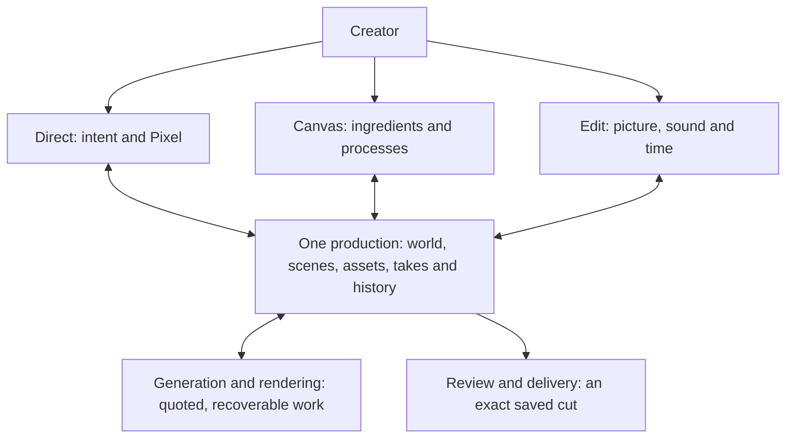

# Shutter product blueprint

September 10, 2026 · working product and architecture map for Dom's review.

This consolidates the original Shutter UltraGodspec, the recovered Lunari Cinema work, Dom's directing decisions and the current standalone implementation. It describes the destination and build order. Features marked **target** are not claims of shipped functionality. The previously approved scene-time/coverage rule remains binding.

## 1. The product we are making

**Shutter is an AI-native filmmaking studio that carries a creative intention from the first image to a finished audiovisual work, preserving its people, world and creative decisions along the way.**

The creator can make an image, animate a Moment, produce a commercial, or build an episode. These are different depths of one production system. A small request should feel immediate; a large production should gain structure as it grows. Imported footage must be as usable as generated footage. The product must remain useful when a generation provider is unavailable.

The proposed first audience is independent filmmakers, animation creators and small creative teams making recurring characters, story sequences and polished short productions. This follows Dom's continuity focus; it is a product assumption, not completed market validation. Moments and commercial work are first-class uses of the same engine. The interface should welcome them without requiring a fictional cast or elaborate worldbuilding.

Our strongest distinction should be the combination of creative direction, persistent production knowledge, controllable footage generation and a dependable editor. A model swap should improve what Shutter can make without erasing the project or changing how the creator works.

## 2. One production, three ways to work

| View | Creator's question | Main experience | Authority |
| --- | --- | --- | --- |
| Direct | What are we making, and what should happen next? | Pixel conversation, brief/script, story beats, visual proposals, chosen references, next useful action | Reads and changes production records through shared commands |
| Canvas | What ingredients and processes make this result? | Connected image, text, audio, video and stage nodes; variants; reusable groups; visible dependencies | Owns layout and explicit workflow dependencies; references shared assets and operations |
| Edit | What does the audience see and hear, and when? | Viewer, source/take browser, timeline, sound, titles/captions and contextual tools | Owns accepted clip placement, source ranges and composition choices |

All three refer to the same project, scene, asset, take, clip and revision. Switching views retains selection and the relevant time position. Selecting a clip in Edit can reveal its generation inputs in Canvas and ask Pixel about that exact clip in Direct. A canvas node can expose an existing clip's timing inspector, but it applies the same timeline operation as Edit.

**The canvas controls dependencies; the timeline controls time.** Moving a card around a board never changes the film's duration. Connecting a new reference never regenerates old footage automatically. Dropping a take onto the timeline creates an explicit placement of that take.

Brief, References, Cast, Places, Shots, Takes, Review and Delivery from the godspec become contextual views, drawers and production stages within this shell. They do not all need permanent top-level navigation. Moment remains a fast entry, and the director panel can close. Manual editing works without chatting.

## 3. The creative journey

**Enter at the work you already have.** The front door accepts a brief, script, reference image, recorded material or an existing production. Image, Moment and Production are creation intents, not disconnected storage systems. A Moment becomes a larger production with its references and history intact. A person importing an existing edit can skip script and casting stages.

**Find the visual language cheaply.** Bring in references or create stills, establish key characters and places, compare composition and lighting, and select promising frames before paying for motion. A style kit records useful references and concrete visual choices. Character identity and current costume/condition are separate. A preset is editable and shows what it changes.

**Plan a scene as an event.** Give it a purpose, starting conditions, actions, ending conditions, intended duration and sound. Plan camera coverage around that event. Several takes may depict the same interval, and some footage will intentionally remain unused. The plan should flag where it needs new footage and where an existing take will do.

**Generate only the next useful material.** A request names the operation, exact inputs, supported settings, variants and cost boundary. Results arrive in the take library with lineage. Compare performances and inspect actual frames and sound. A usable result can be selected, trimmed, repaired or reused without recreating the rest of the scene.

**Cut and finish.** Place footage, change angles, carry sound across cuts, add voice/music/effects, adjust pacing and add titles or captions. Pixel can propose an edit or perform an already authorized change. The creator can always manipulate the same work directly and undo a grouped change.

**Deliver a version.** Preview, export and review refer to a precise saved cut. The creator receives the audiovisual file and can retain an editable package. A later cut does not overwrite the evidence of what someone previously reviewed.

Example: “Mira returns in the rain, gives Sol the sphere, and watches him activate the observatory.” Shutter should expose wet Mira, dry Sol, one sphere, the handoff and the console placement as the facts that matter. A new angle references their state at the relevant time. If a render keeps the sphere in Sol's hand, the creator can reject or replace that take; a successful download cannot declare the action correct.

## 4. Visual and interaction system

The product law is **the film is the centre of the room**. The current graphite/sage treatment is a foundation, not the final brand ceiling. Actual imagery carries the colour and emotional character. Controls stay calm and readable. Large utility panels earn their space by supporting the current action.

| Surface | Visual hierarchy | Useful behaviour |
| --- | --- | --- |
| Project entry | Recent work and a single creation/import affordance | Resume a production or start from the material at hand |
| Direct | Viewer or visual proposal first, concise conversation second | Pixel shows editable frames, shot options or an edit proposal alongside its words |
| Canvas | Media and meaningful connections, restrained chrome | Pan/zoom, group, compare variants, inspect inputs, run a selected process with a cost preview |
| Edit | Picture and sound together, with clear time rulers | Source viewer versus sequence viewer, visible selection, familiar trim/move/split tools and keyboard actions |
| Work tray | Compact activity with precise next actions | Show render, import, save, conflict, estimate and export details when relevant |

One contextual inspector follows the selection. Advanced model parameters, technical media details and diagnostic receipts stay out of the default creative flow. Expand them when needed. Reference locks and the scope of an AI change must be visible in ordinary language.

No invented percentages, fake waveforms or empty agent chatter. Waiting states say what is actually happening. Pixel's work appears as concrete changes or proposals linked to the affected material. Motion should communicate selection, placement or progress, not make the workspace fidget.

Stable panels and media lifetimes must preserve playhead, selection and in-progress work across updates. Large productions require a browsable/virtualized library and cached thumbnails/proxies; loading every full video for every visible card is a prototype convenience. Narrow screens prioritize review, direction and deliberate edits, with independently scrollable canvas and tracks. We should not shrink a desktop editing layout until it becomes illegible.

## 5. Pixel and the crew

Pixel remains the creative director. Preserve its visual judgement and voice from Lunari, while replacing legacy model defaults and claims of guaranteed identity locking with actual Shutter capabilities. The active scheduler prompt imports `services/agent_souls/pixel.js`; that file's older “not wired” comment is stale relative to the inspected caller.

| Department | Concrete responsibility | Saved output |
| --- | --- | --- |
| Pixel | Interpret intent, choose a coherent approach, coordinate work and resolve tradeoffs | Scene plan, proposed changes, review decisions and next action |
| CAST | Identity, performance cues, costume, condition and ownership of props | Versioned character references and state at scene beats |
| SET | Geography, environment, lighting, props and background progression | Location references and scene constraints |
| LENS | Composition, screen direction, camera motion, coverage and blocking | Camera/take plan on scene time; optional 3D blockout |
| FRAME | Stills, reference packs, keyframes and visual variants | Versioned assets and normalized generation inputs |
| CUT | Performance selection, pacing, source trims, picture/sound relationships | Reversible changes to the actual sequence |

These are responsibilities, not a requirement to run five premium models for every action. One capable connected agent can cover several roles. Separate bounded work only when it improves the result. Exact timing, media decoding, budget arithmetic and export remain software operations.

The recommended first agent route is a portable Pixel procedure using the existing Shutter command boundary through MCP. Dom's current inline Codex workflow remains the development route; adding Claude or another provider is deferred. A future native conversation panel needs a deliberately supported inference arrangement. A consumer subscription is not assumed to pay for arbitrary Shutter server inference.

Human and agent changes share stable IDs, revision checks and meaningful undo groups. A locked reference or edit cannot be silently overwritten by an agent. Existing authority should permit ordinary reversible work without repeated approvals. Spending can proceed inside a previously granted, explicit scope and ceiling; work outside it needs a new decision. Imported text, metadata and media cannot grant authority.

Agent progress distinguishes proposed, applied, running, waiting, failed and verified. A success message is not proof of a completed edit or reviewed video. Resource/tool limits are bounded by measured capacity; a breached limit pauses the run with a visible reason. No speculative numeric threshold is asserted here.

## 6. The continuity engine

There are three distinct time mappings:

1. **Source time:** the frames or samples inside one recorded/generated take.
2. **Scene time:** when actions occur within the shared performance depicted by different camera views.
3. **Sequence time:** when selected scene material appears in the finished edit, including reordered scenes or flashbacks.

The story's chronology and character state are explicit scene/beat relationships; they are not inferred solely from where a clip happens to sit in the final sequence. Reordering a scene does not retroactively change the state in which its footage was generated.

The accepted 60-second example remains: four main-view takes cover scene 0–60; an alternate angle replaces scene 14–17; the main view returns at scene 17, corresponding to source second 2 of its second take. The original performance and selected sound continue under the coverage. Runtime stays 60 seconds.

Store only meaningful continuity facts: which person holds the sphere, whether a coat is wet, the stage of an action, positions/eyelines, light/weather and a small number of environment invariants. Do not build a universal physical simulation to describe a short film. Intended state and observed state are separate. An unreviewed render does not update the story as though the requested action certainly occurred.

A coverage request receives the same action schedule and the state at its scene interval. Reference frames guide identity and composition, not guaranteed temporal synchronization. Review the actual results. Cuts can hide a render boundary; they cannot establish that a contradictory performance has become correct.

Locks protect selected versions of identity, appearance, set, shot composition or edit decisions. A change produces an affected-work list and a proposal for future use. Submitted takes and accepted prior exports remain immutable. Every generation budget includes discarded variants and unused handles as well as visible runtime.

## 7. One media and composition core

The largest immediate model gap is that the current timeline points to ready generation jobs. A professional editor needs to place media from any supported source. **A timeline clip should reference an asset version, with optional take/job provenance, rather than require generation to exist.** Imported media must not acquire a fictional render job just to become editable.

| Domain | Owns | Must not be confused with |
| --- | --- | --- |
| Production / scenes | Brief, shot intent, source references and scene relationships | A transcript archive or a second copy of a Lunari project |
| Asset version | Original bytes, digest, media facts, source and derived previews | A temporary URL or a generation success claim |
| Reference version / state | Selected identities, looks, places and conditions | Proof that a render stayed consistent |
| Shot / take | Intended coverage versus a realized candidate with provenance | A clip's placement in the final cut |
| Canvas workflow | Typed inputs/outputs, layout, operation dependencies and cached results | Implicit editing order or unlimited permission to run |
| Sequence / clip | Asset version, source range, scene mapping, placement and supported picture/sound choices | The generation job's nominal duration |
| Work / budget | Frozen request, price basis, reservation, provider receipt and outcome | Chat text saying “done” or an assumed refund |
| Review / delivery | Evidence and comments attached to exact media/cut versions | Blanket approval of later changes |

Use a versioned composition model and a compiler shared by preview and export. Rational times or exact ticks must preserve fractional frame rates, source ranges and audio timing. Existing 24 fps studies retain their exact frames. Mixed-rate media requires a qualified normalization or timestamp mapping path; changing a float field is insufficient. Still images have an explicit placement duration. Gaps and supported overlaps are deliberate.

Keep one authoritative local store and job ledger while the product matures. The current SQLite application can continue to host these records. New logical concepts do not each require a database service, message bus or LLM. UI components, MCP and later hosted clients use the same domain operations.

Conceptual shared operations: read scoped production context; import/probe/relink media; apply a revisioned batch of edits; connect references; prepare/submit/reconcile a generation; inspect chosen media intervals; render/export an exact sequence; record a version-bound review. Exact wire schemas belong to the next bounded implementation plans. Nothing here authorizes arbitrary shell or editor code from an agent.

## 8. Canvas as a reusable production workflow

The current reference board is the first layer. The target expands it with typed, inspectable operations:

- Inputs: notes/scripts, approved image references, existing video, voice/music/effects, scene state and 3D stage passes.
- Processes: compose/edit a frame, prepare a shot, generate a bounded set of takes, inspect media, derive a mask, make a supported composite or create an explicitly timed placement.
- Outputs: reference variants, candidate footage, selected assets, reusable groups and deliveries.

Every runnable node declares accepted media kinds, parameters, upstream versions, result type and cost behaviour. A static text node is input, not an automatic LLM call. “Run this group” previews its required work and uses cached results when the accepted inputs and operation versions match. Cycles or incompatible inputs fail before paid work. Changing an upstream reference marks affected downstream proposals as out of date while preserving their existing results.

Users can duplicate a workflow as a template with replaceable inputs. Useful early templates are an image-to-Moment, a recurring-character scene, a product demonstration and an alternate-angle coverage request. The canvas should reveal useful control without forcing beginners to assemble a graph before their first result.

## 9. The deeper creative tools

**Image and character creation:** a real still-image path, reference collections, pose/expression/costume variants, keyframes and selected frame promotion into video. Start with imported or supported connected-tool assets; qualify managed image generation separately. The current built-in image workflow did not expose a model version, so it is not a product claim about a named ChatGPT image model.

**Sound:** independent dialogue/voice, music and effects tracks; real waveforms; trims, fades, gain, mute/solo and alignment. Captions have editable text/timing and follow exact source versions. Sound carries across visual cuts. Later language/voice variants keep their lineage. No full DAW is a prerequisite.

**3D direction:** Blender provides an optional stage for cameras, blocking, geography, light and derived visual guides. Shutter should bind the selected stage/camera/time to generated references and footage. Existing blockouts are useful evidence; they do not prove interactive camera control or that a model will follow every geometry pass.

**Targeted repair:** select a face, prop, background or region over an interval; create a bounded variant and compare it with the original. True preservation of unaffected pixels requires a qualified tracking/mask/compositing path. A model that redraws a whole clip cannot be advertised as exact object replacement just because the prompt asked it to preserve everything else.

**Finishing and interchange:** consistent SDR colour, declared transforms/effects, titles, aspect versions, supported caption exports and selected external-editor handoffs. DaVinci/OTIO-style interchange is qualified by opening exported fixtures in the target editor and reporting unsupported effects. Merely emitting an OTIO-shaped file does not establish compatibility. Upscaling and other paid finishing are separate choices when the underlying piece earns them.

## 10. Options and the chosen direction

| Approach | Learning burden | Editing precision | Automation and reuse | Main cost |
| --- | --- | --- | --- | --- |
| Conversation as the whole product | Low initial burden | Repeated verbal targeting becomes awkward | Good for intent, weak visibility of dependencies | Hidden state and repeated inference |
| Node canvas as the whole product | High for beginners | Time and sound are awkward without an editor | Strong reusable workflows | Every creator must learn graph construction |
| Shared production with Direct / Canvas / Edit | Simple entry with deeper control available | Timeline owns exact timing | Both guided creation and explicit reusable processes | Requires disciplined shared state and selection |

Choose the third approach. The current implementation already establishes these views and shared records; the original godspec requires a manual studio as well as AI assistance. The strongest risk is rebuilding three separate applications inside the shell. Revisit the design if the same task requires duplicate saves, duplicated assets, or unexplained navigation. Keep a task in its natural view and expose cross-view context only when it helps.

Preserve the existing local app and add capabilities in bounded slices. No framework rewrite, donor backend transplant, new inference provider or hosted infrastructure is needed to accept this product map. Reconsider UI implementation choices when stable playback, incremental updates or measured complexity require it, not to decorate the roadmap.

## 11. Build order and proof

| Milestone | Observable result | Prerequisites and proof |
| --- | --- | --- |
| M1 · Any supported footage can be edited | Import footage or start empty; append, split, trim, move and replace a source/take; preview it without exporting after every edit | General asset-backed clips, source metadata, explicit draft sequence and stable preview state. Use the real UI and shared commands. A take replacement keeps intended trims/placement or explains an insufficient source. |
| M2 · A complete audiovisual piece | Add a still, voice, music, title and corrected captions; listen, save, export and cold-reopen | Build on M1's composition model. Verify picture frames and audio events in the exported file. No generation provider is needed for this journey. |
| M3 · A scene remembers its world | References, conditions, prop ownership and beats guide each shot and alternate angle | Separate intended/observed state and attach scene-time mappings. Exercise the 60-second coverage rule. New-generation synchronization requires a later bounded paid experiment. |
| M4 · Pixel operates the real studio | Natural direction produces scoped, reversible changes; creator locks survive; approved work is recoverable | Expose the proven operations through MCP and a portable directing procedure. Compare actual resulting media/edit records, not merely the agent's narrative. Native managed chat is a separate delivery option. |
| M5 · Workflows are reusable | Save and rerun a selected media workflow with replaced inputs, cached outputs and explicit cost scope | Typed workflow operations over M1–M4. Changed dependencies affect only the required downstream work. Interrupted paid work reconciles before retry. |
| M6 · Deeper cinematic control | Qualified stage/camera workflows, targeted repairs and selected finishing/interchange | Each capability gets a small demonstrated journey and declared limits. Preserve sources and compare versions. Do not bundle all VFX/audio ambitions into one release gate. |
| M7 · Episodes and a commercial beta | Multi-scene organization, usable long-project navigation, recovery, delivery and clean-account onboarding | Test a 20-minute project with existing/fixture media for engineering scale, separately from creative quality. Demonstrate a complete real production and recovery. Qualify hosting/access, data handling, support, spending and economics before public use. |

M1 is the next implementation slice. It addresses the structural dependence on generated jobs before faster preview and more editing controls make that dependence expensive to unwind. M2 completes the original godspec's first manual-film journey. Generation capabilities already implemented remain available; their existence does not mean the manual-studio gate is complete.

M5 and M6 are expansion paths, not blanket prerequisites for a first paid creator beta. A focused beta should prove M1/M2, the selected continuity/directing workflow from M3/M4, and the relevant access, cost and recovery obligations in M7. Advertised production lengths must match the qualified scale. Full VFX, every workflow node and every external-editor adapter do not have to ship at once.

This sequence is dependency-driven, not a calendar or a promise that each milestone fits one session. Separate plans will define exact code changes and measurable performance thresholds after baseline measurement. Avoid arbitrary targets presented as observed capacity.

### Requirement-to-proof map

| Requirement | Design owner | Acceptance signal |
| --- | --- | --- |
| R01 · One production across manual and agent surfaces | Shared domain commands and selection context | An edit made from either surface reopens identically in the other, with one revision history; M1/M4 |
| R02 · Imported material is editable without generation | Asset-backed clips and general ingest | Import supported footage, trim, save, reopen and export without creating a generation job; M1/M2 |
| R03 · Quick work can grow into a film | Common work/assets and scene references | Promote an image/Moment into a production without reimporting media or losing lineage; M3/M5 |
| R04 · Picture cuts preserve intended scene time | Scene mapping plus sequence compiler | Coverage at 14–17 keeps a 60-second scene at 60 seconds and returns to elapsed main footage; M3 |
| R05 · A finished audiovisual piece survives recovery | Composition, audio and media persistence | Cold reopen reproduces source ranges, visual elements and audible timed fixtures in export; M2 |
| R06 · Pixel respects human decisions | Stable IDs, locks, revisioned operations and scoped authority | Reject a stale or locked-field change; apply a valid authorized batch with a single meaningful undo; M4 |
| R07 · Paid work is bounded and recoverable | Frozen requests, budget ledger and provider reconciliation | A repeated request or lost acknowledgement cannot silently submit a second charged job; M4/M5, preserving existing guards |
| R08 · Reuse does not cause unnecessary rerendering | Typed workflow versions and cached outputs | An unchanged group reuses results; a changed input proposes only affected work; M5 |
| R09 · Quality claims refer to actual media | Review artifacts and observed-state records | Findings identify inspected frames/intervals and unresolved details; no metadata-only pass; M3/M4/M6 |
| R10 · Scale, portability and launch claims are earned | Resource management, recovery and qualified adapters | Long-project navigation/recovery fixture plus selected external-output checks; commercial gate in M7 |

## 12. Recovery, adoption and commercial boundaries

Preserve every existing asset, take and timeline. Introduce asset-backed source references with a compatibility resolver for the current job-backed clips. Migrate a copied production first, compare the compiled ranges/output, then adopt by an explicit versioned save. Keep the previous sequence revision and packaged source readable. Do not silently reinterpret old 24 fps source indices.

Import failures retain the source identity and a repair/relink route. Preview failures show missing/buffering media rather than stale frames. Edit conflicts preserve the user's draft. A failed operation batch is atomic within its declared boundary. Lost provider acknowledgement remains outcome unknown until reconciled. A changed input cannot reuse an earlier quote as if nothing changed. Export failures retain the prior valid export.

Shutter owns media/production state; Lunari embeds or connects to that same authority. Boardroom briefs and Nitelite review are eventual reference-based integrations, not duplicated document/conversation databases. Their service dependencies must not block standalone editing. Existing customer projects are not migrated by this blueprint.

The commercial value is the studio, its persistent creative work, reusable methods, editing and delivery. Optional customer-connected agents reduce the need for a mandatory Shutter inference subscription. Video generation, storage and rendering still have real costs. Measure them, including unused takes and support, before selecting prices. Dom remains the pricing decision owner; no launch tiers or margins are invented here.

Local work stays local until a deliberate provider/cloud operation. A hosted beta needs account-bound asset, job, sequence and review access; credential handling belongs to the service, never prompt text or browser key fields. Export/share and generation are separate permissions. These are release obligations for the actual hosted product, not new infrastructure work in this design pass.

## 13. Current reality and evidence

**Verified in this pass:** four productions, seven shots in the active study, 20 render jobs and zero active/unknown jobs. Current tracked funds remain $4.72154. No provider request or product mutation was made for this architecture pass. Existing code includes Direct/Canvas/Edit, immutable assets and job snapshots, CAS saves, 10 local MCP tools, H3 Max integration, and a main/coverage timeline compiler. The prior implementation checkpoint records 41 passing tests and browser verification; those tests were not rerun for document-only work.

**Important gaps confirmed in source:** import records sniff supported media but do not provide a full general editor ingest/proxy pipeline; `compileTimeline` resolves clips through ready jobs; initial timeline creation demands selected takes for every shot; sound currently follows the main takes; preview is a local export; Direct has no embedded LLM and Canvas has no general execution scheduler.

**Intent:** the September 6 UltraGodspec defines a larger studio with manual editing, sound, recovery, reviewed generation, shared integration and professional expansion. Its historical Cinema defects are not current Shutter bug reports. The earlier repository README describes the first local prototype and should be read with the current checkpoint.

**Unresolved product choices:** validate the first customer segment with actual creators; choose pricing after unit-cost evidence; select the supported launch codec/profile matrix through fixtures; decide managed native-chat economics only after agent operations work; choose hosting/deployment when preparing a hosted beta. These do not prevent M1 or M2.

Source map:

- Founder instructions in this task: standalone cinema ambition, Moment retention, H3-only current spending, saved knowledge, shared-time coverage, inline development, original Lunari reuse, and clearer visual/manual/agent workflows.
- `C:/dev/eternities-canon/sources/astra-reconstruction-2026-09-07/03_PRODUCTS_01_09/expanded/batch_02_04/shutter/GODSPEC.md` and `docs/FIRST_BUILD.md`: target product and first complete journey, inspected September 10.
- `C:/dev/shutter/docs/scene-time-and-coverage.md`: approved directing invariant. Historical implementation statements in that document are superseded by the timeline checkpoint.
- `C:/dev/shutter/docs/studio-workspace-results.md`, `src/store.mjs`, `src/timeline.mjs`, `src/mcp.mjs`, `public/timeline.js`: current capabilities and concrete gaps.
- `C:/dev/.worktrees/lunari-scheduler-beta-rails-v288/services/pixelsystemprompt.js`, `services/agent_souls/pixel.js`, `app/engines/cinema.js`: active prompt import and CAST/SET/LENS/FRAME/CUT contracts. Source inspected; no live crew orchestration qualification asserted.
- Task `outputs/shutter/pixel-architecture-review.md`: preserved wider donor audit, including newer frontend recovery and timeline operations. Its earlier eight-tool/no-timeline Shutter snapshot is historical; current code has ten MCP tools and implemented timeline editing.
- `D:/codex-migration/bundle/workspaces/dev/lunari/docs/cinema/_helionyx-teardown-EXTRACTED.md` and `LUNARI-Cinema-E0-E1-Build-Plan-2026-06-13.md`: recovered choreography/navigation lessons from the prior design pass.

Self-review: the map preserves one state authority, manual access, selected-reference lineage, scene-time coverage, bounded spending and reusable agent commands. It explicitly distinguishes the current reference canvas from workflow execution and engineering scale tests from creative episode quality. No claim of complete Higgsfield or DaVinci parity is made. No application code, media, provider configuration or spending was changed to produce this map.
